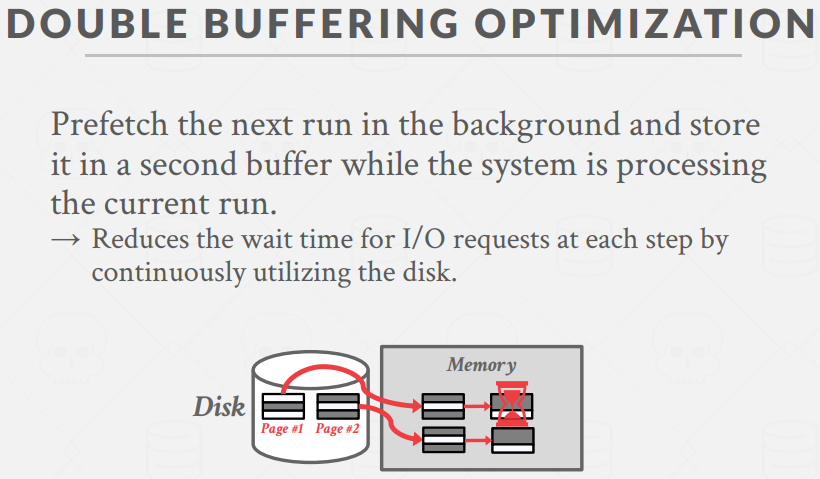
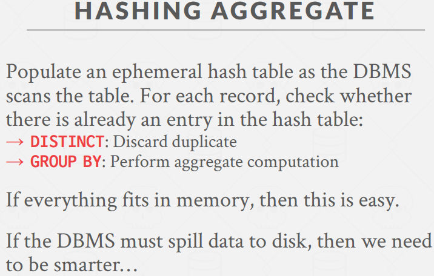

### DB架构
  

### 查询计划
查询计划是一条指令，它是数据库系统具体如何执行一个给定查询的方式。查询计划一般被整理为一个树形结构或者是一个有向无环图。在树的叶子节点上，我们对表进行扫描或访问，将tuple上移给下一个operator，让该operator做想做的事情。  

   
以该sql为例，对B中的结果进行过滤，排除所有不大于100的数据，将结果传给上层的join operator，然后该operator生成输出结果，交给上层的projection operator。  

需要注意的是，这里的查询计划是logical plan(逻辑计划)，我们不会讨论关于怎么去实现这些不同operator的事情。例如，我们向做join，但不会讨论具体如何把两个输出结果join起来；join需要获取表A的数据，但我们不会具体讨论如果取表A，是顺序扫描，还是索引扫描来获取tuple。  

作为面向磁盘的数据库，我们不能假设一张表可以完全fit在内存中，或索引可以完全fit在内存中；我们也不能假设一次查询结果可以完全fit在内存中，或者是查询中某些operator的中间结果能完全放在内存中。我们需要使用buffer pool来实现与磁盘交互的算法，会设计某种偏好算法来尽量使该算法能最大化sequential I/O获取数据的流量。  
这也是为什么要DBMS自己管理内存而不是交给OS来管理内存的原因之一，OS发现operator的中间结果存放的page是用来保存临时数据的，用于执行自己的查询，当查询结果，OS就会把该page给丢弃，但DBMS可能会用该查询结果做一些其它的事情。  

因此，我们需要External Merge Sort(外部归并排序)算法和Aggregations(聚合操作)。  
在sorting和hash这两种不同的方法间存在着trade-off。

### Sorting

#### 需要sorting的原因
我们需要确保所有的数据都放在正确的环境中，从本质上来说，在关系型模型中，所有的tuple都是无序的，它是种代数集合，没有顺序。所以，我们不能假定我们读取的数据是按某种特定的顺序进行的。  

有时，query会显式的要求tuples以某种顺序排序，例如使用ORDER BY。但有时候即使query没有特定要求某种顺序，我们可能会想对数据库系统中执行的查询做些优化。例如，对DISTINCT来说，有序的中间结果可以帮助系统很简单的去除掉冗余tuple，只需要顺序遍历即可；对于GROUP BY来说，如果结果被排好序，那么我们就可以扫描一次表，然后根据需要来生成聚合结果；我们也会讨论如何对bulk进行优化，比如B+树中的bulk loading(加载大量数据)，如果沿着叶子节点对所有数据进行了预排序，然后我们就可以自下而上的去构建索引，这种方式会更高效。综上，我们都需要sorting来处理超过内存量的数据。

   

如果内存能cache住所有数据，那么传统的快排、堆排序、冒泡之类的都是很有效，担当数据没法一口气放在内存中，那么快排就是个很糟糕的选择，因为快排会进行大量的随即跳转，它会随即跳转到内存中的不同位置上，那么对上述场景来说，随即跳转意味着随机I/O，因为我们跳转的page可能实际不是在内存中的。所以我们要一种能在磁盘上进行读写数据的成本也考虑进去的算法，该算法能做出某种决策，试着最大化循序I/O所获取的数据量。即便是在速度更快的SSD上，顺序I/O也远比随机I/O来的高效。  

#### TOP-N Heap Sort
   

#### External Merge Sort
divide-and-conquer。将需要排序的数据集分为多个更小的数据块，称为runs，这些runs属于需要排序的整个key集合中彼此不相交的子集。对run内的tuple进行排序，使每个run内的key都是有序的。

Phase1：将数据块放入内存并对它们进行排序，将排序完的结果写回磁盘  
Phase2：将排好序的runs合并为更大的runs  
重复上述过程，直至完成排序  

   

在这里，run更具体的解释是一个包含多个kv对的list，其中key是用于做排序的比较属性，value则是tuple或record ID，具体是哪一种取决于物化的时间点。  
提前物化意味着在排序时value存放tuple data，滞后物化排序时value存放record ID，这是考虑到有些tuple过大，参与排序的话影响执行效率。

   

##### 2-Way External Merge Sort
2-way外部归并排序指的是每一轮将2个runs合并为一个新的run。  

假设待排序的数据集被分为N个page，DBMS给该operator提供B个buffer page。该数值一般有数据库系统指定，例如对PostgreSQL中，它被称为working memory，即在执行中间操作时被允许使用的内存量。可以在可用内存之上构建一个hash table，做排序或其他事情，所以我们一般总是在执行前就知道这个可用内存量。

   
在Pass0中，每次从磁盘中读B个page到内存中，在内存中对它们进行排序，将排序完的结果写回磁盘。一个run的大小就是B个page。   
在后续的Pass中，我们会对目前已排好序的run进行递归合并，所以生成的run是输入的run的两倍大。  
对于这种方法，至少需要三个buffer page，因为我们需要2个page保存输入的run，一个page对应一个run，另外需要1个page保存输出结果。实际上，在该例子中，输出的run有2个page大，我们会使用2个游标来扫描两个输入page的内容，依次比较，将page写满后就写出到磁盘，再继续合并。  

下图说明了采用2路外部归并排序的轮数和总共的I/O开销。其中，2N是因为在每一轮的过程中，每一页都会有一次写入read和写出write的过程。
   

对于2路外部归并排序，我们只需要3个buffer page就可以完成该算法，其中包含2个用于输入的page和1个用于输出的page。但是它存在一个问题，那就是更多的buffer page不会带来效率上的提升，因为I/O次数不会因为page变多而降低，在每一轮里，我们总是需要访问两个输入page的cursor进行比较并将较小的kv放入输出page，当输入page的cursor到底则取新page放入内存，当输出page满则写入磁盘并刷新，所以page变多也不影响某一时刻访问的page数量或I/O次数。

针对该问题，我们可以通过prefetch(预取)来最小化I/O成本。这种prefetching技术叫做double buffering。它的思想是：当你对两个page做merge时，通过使用shadow page/shadow buffer来接收你要排序的下一个run/page，从而减少异步I/O的数量，在后台获取接下来的page。  
如果是单线程系统，那么所有操作都是同步的，就会看到乒乓效应。因为工作任务会在CPU密集型和磁盘密集型间来回切换，当作sort时基本只使用CPU，当load和写回时基本只使用磁盘。  
   

##### General External Merge Sort
在Pass0，拆分为多个run，每个run的初始大小都是B(这里是B而非B-1的原因，大概是我们有B个page，而需要排序的数据集大小也为B，我们直接做内存上排序即可，比如直接使用快排进行原地修改)。   
从Pass1开始，每个都是合并B-1个run为一个新的run，因为我们从头到尾都需要一个用于保存输出结果的buffer page。使用额外的输出page是没有必要的，因为只会有一条线程来对该apge进行写操作。  
   
在真实系统中，我们如要注意输入page的来源，如果它来源于表本身，那么我们不能修改它，需要拷贝出表的副本进行排序；如果它来自于另一个operator，那么我们可以直接对它进行修改。  

#### Sort using B+ Trees
我们可以使用现有的手段来加速排序。例如，我们可以用过已经排好序的东西(比如B+树)来完成一些工作(比如范围查询)，而无需再去做额外的排序。当然，这需要我们想要排序中的key和B+树上索引中的key是一样的，才可以复用这棵B+树。  
但这只适用于我们拥有的是clustered B+ tree(聚簇索引)，而非unclustered B+ tree。聚簇索引指的是page中tuple的物理位置和我们在索引中定义的顺序相匹配。  

在这种情况下，我们只需要从左到右遍历叶节点即可，因为现在遍历根据key得到的tuple的顺序一定匹配tuple在树中存放的顺序。所以我们不需要任何额外的计算，且I/O访问都是顺序的。   
   
如果是非聚簇索引，每个record可能都需要做一次I/O，成本较大。   
   

### Aggregations
聚合，即将多个tuple中的单个属性的值折叠为单个标量值。DBMS需要一种方法来快速找到具有相同属性的tuple，以此进行grouping。  

主要有两种实现方式，分别为sorting和hashing。Sorting是做大量的顺序访问(sequential access)，而hashing是做随机访问(random access)，在不同场景下有不同的优势。一般来说，不管磁盘的速度有多快，hashing的效果会更好。  

   
以上述sql为例，查询计划树中最先做的是过滤，然后根据projection移除所有结果中不需要的列，最后做排序，由于DISTINCT关键字，我们需要通过游标遍历这一列，去除冗余数据。  

但是实际上，很多场景并不需要我们做专门做排序。  
   

当DBMS扫描表时，创建一个临时的hash table用于存放数据。  
   

当内存不足以cache住这张临时hash table时，我们要试着最大化对每个放入内存中的page所做的工作量。External hashing aggregate做的就是这个事情，它和外部归并排序类似，都采用divide-and-conquer的思想。

传入数据，所有具有相同key的tuple会被放在同一个分区中；对每一个分区，构建一个内存中hash table。这样可以最大化sequential I/O的工作量。  
   

在Phase1，我们要做的事情就是将这些tuple拆分到不同的分区中，然后根据需要可以将其写到磁盘中。hash函数是任意的，比如Murmurhash、CityHash、XXHash3等等，确保相同key的tuple一定会落入同一个分区即可。当分区存满了，利用buffer manager写出到磁盘上。当有B个buffer page时，我们就可以分配B-1个分区。  
   
   

在Phase2，我们对每个分区(bucket/partition)进行rehash。对每个分区，会将该分区的page依次写入内存，构建一个hash table，遍历page。当我们扫描完分区内的所有page时，我们会去计算想要的答案，然后将该hash table扔掉，因为我们知道结果已经生成了，而该分区内在hash table上所更新的key，永远不会被其它分区更新，因为Phase1保证相同的key一定在同一个分区中，Phase1的hash为我们保证了局部性。  
   
   

   
这里RunningVal具体的类型取决于sql语句的期望数据。  
  