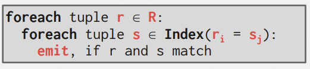

### Join的必要性
Join操作是关系型数据库系统和范式化表所产生的副产物，因为我们会通过将数据集拆分，来减少重复冗余的信息，所以可能会将一个表拆分为多个表。所以在许多场景下，我们会使用join操作符来将表连接，重组出原先更完整的tuple。  

## Join Algorithms
本章我们只关注两张table间的inner equijoin算法，这是目前数据库系统中最常见的算法。虽然存在M-way join算法，但这大部分时候只存在于理论中，少数高端系统支持该项。  
inner equijoin中的equi指的是从一张表中拿到一个tuple，去检查它能否和另一张表中的tuple匹配上。其它的outer join，非相等的如大于、小于、不等于都能在上述算法基础上少量改动实现。  
有一点要注意的是，我们通常会把更小的表放在join操作的左边，被称为outer table，右表称为inner table。  

  
对一个查询计划来说，我们会拿到这个sql查询的关系代数，然后将它转换为一个有向图或一棵树。在叶子节点处，我们要对表进行访问，然后将表中的tuple作为输入传给父节点的operator处。   

### Join操作的决定因素
1.	Output：在查询计划树中，join操作符向它的父节点操作符传输的数据是怎么样的。  
2.	Cost Analysis Criteria：我们该如何确定两个join算法孰优孰劣。  
  
  

### Join操作符的输出

#### 面对行存储的early materialization
第一种做法，面对行存储时会如下图的方式执行：  
  
  
这种做法的好处在于，在这棵树中，我们永远不需要回头去从base table中拿更多的数据。因为R表和S表组合出的数据会被用来生成inner join的输出结果。但糟糕的地方在于，我们会生成巨大的tuple，该tuple中的很多属性可能是sql查询结果根本不涉及的。  

#### 面对列存储的late materialization
另一种方式主要出现于列式存储中，也就是之传入我们所需的最小限度的信息，即join keys。所需最小限度的信息中，需要包括匹配join条件的tuple的record id，通过它可以找到表中该tuple的其余属性。  
  
  
对列式存储来说，这种方式很理想。因为要将所有不同列的tuple粘合到一起，从列形式变为行形式，然后再传给查询计划，这个过程的代价过于昂贵。  
所以，如果我们可以尽可能延迟这种tuple生成操作，这种生成操作会把所有的列数据变回tuple原本的一行一行的形式，那么我们就不用向上传一大堆数据了。  

### Join操作符的I/O开销分析
假设R表涉及M个page，包含m个tuple；S表涉及N个page，包含n个tuple。此处的I/O成本只考虑写入到内存的次数，因为输出结果写出到磁盘跟join后表的大小相关，这个根据表内容和sql会有变化。

### Join算法分类
-	Nested Loop Join
	-	Simple/Stupid
	-	Block
	-	Index
-	Sort-Merge Join
-	Hash Join

### Stupid Nested Loop Join
顾名思义，两层嵌套的for循环，从而遍历到每一对tuple组，查看join子句和where子句中的条件部分是否满足条件，若满足则输出生成。  
  
显然这种做法效率很低，它的处理成本是很高的，最差情况下，考虑每次读tuple都是内存不明中的，首先M个page的外表需要分别取出一次放在缓冲区中，且对外表中的每个tuple，都要去访问一遍内表，所以又会读取m * N个page。所以，outer page是小表通常是更优的选择。  
  

### Block Nested Loop Join
  
从算法效率而言，它和stupid的开销是相同的，但考虑到面向磁盘I/O，先前是外表的每个tuple和内表的每个tuple做join，现在则是外表的每个page和内表的每个page做join。所以开销从原来的M + (m * N) 变为 M + (M * N)。  
需要注意的是，我们谈到的小表是占用page数更少的表，而非tuple更少的表。 

上处实际使用了3个buffer page，outer page、inner page、output各分配一个。当我们考虑有B个buffer时，算法能得到优化。即使用B-2个page存放外表，1个存放内表，1个存储输出结果。  
  
随后算法可以变成这样。在开销上，外表的每个page还是只会读取一次，而内表的每个page不需要读取M次了，而是读取 M / (B-2) 次。

  
时间上，由原来的一个多小时，到50s，到现在仅需要0.15s就能搞定。一个是算法上针对I/O的优化，一个是buffer空间的变大。

所以，事实上当buffer空间足够大到cache住表page总数时，nested loop join算法的性能还是比较OK的。它的问题主要在于，对表的已有信息完全不利用，需要对内表每次做sequential scan而导致开销极具增长导致的。

### Index Nested Loop Join
有一种优化的手段是，当我们进行join操作的key正好建立了索引，就可以把索引利用上，作为在内循环时的一部分使用。  
  