### Disk-oriented architecture
我们关注的数据库的主要存储位置都是放在磁盘上的，即面向磁盘型数据库系统，它会管理数据从非易失性(non-volatile)存储到易失性(volatile)存储之间的movement.
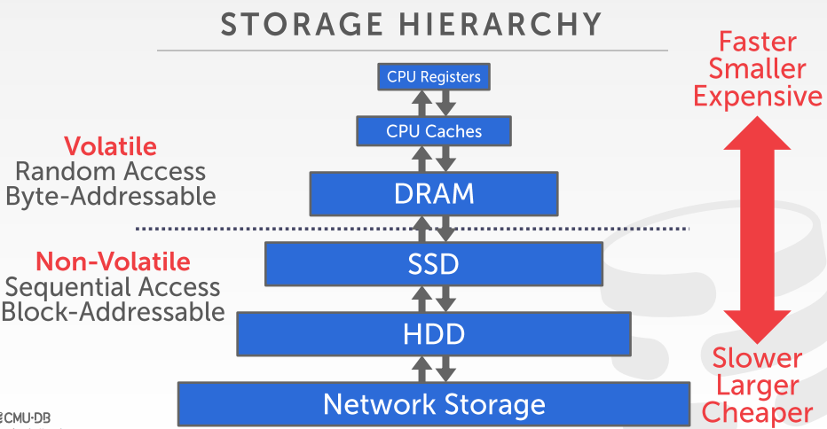   
-	在易失性存储中，随机读写模式使得访问任意区域的用时接近，且读写单位是bit；在非易失性存储中，顺序读写效率更高，且按块或页为单位访问数据。

### Disk-oriented architecture
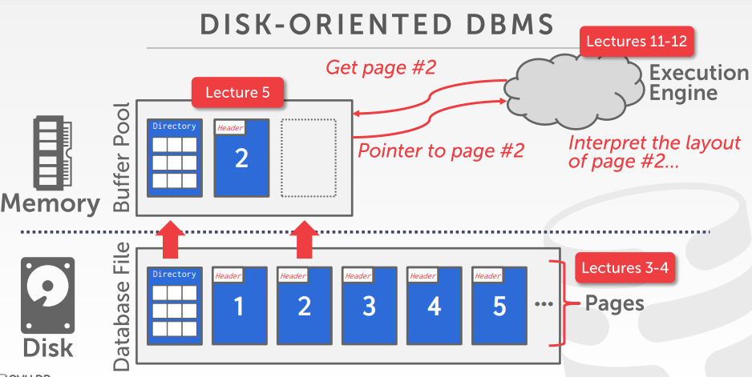  
类似操作系统的页面替换，面向磁盘的数据库管理系统会通过内存中的buffer pool换入磁盘上的页来获取数据。

#### why not use the OS?
-	可以直接交给操作系统管理，用内存映射技术(memory mapping,mmap)来存储，该技术会从磁盘上获取文件，然后告诉OS将文件页面映射到我的进程所属的地址空间中，之后我的进程就可以对该文件读写，需要换出时通过Sync操作将其写回到磁盘上。

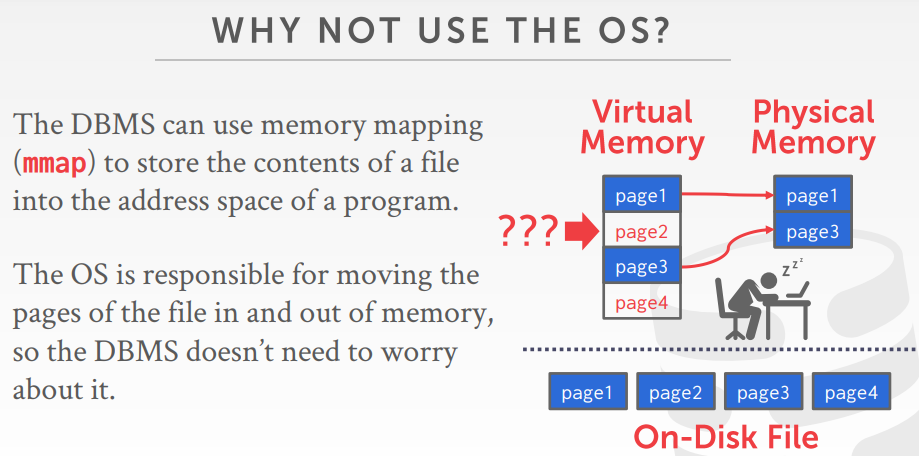  
面对图中情况，为了页面替换可以执行，我们不得不让数据库系统停掉请求page1/3的线程。除此以外，如果有一些写入进程，OS并不知道哪些page需要在其他page执行之前先从内存中刷到磁盘中，这与日志与并发控制相关。

-	有一些解决方法。如用madvise告诉OS读取page的顺序，用mlock来告诉OS哪些pages不可以被回收，我们可以锁定但并不能阻止page被写出到磁盘，用msync告诉OS将数据刷到磁盘中。会存在很多性能瓶颈问题需要解决。

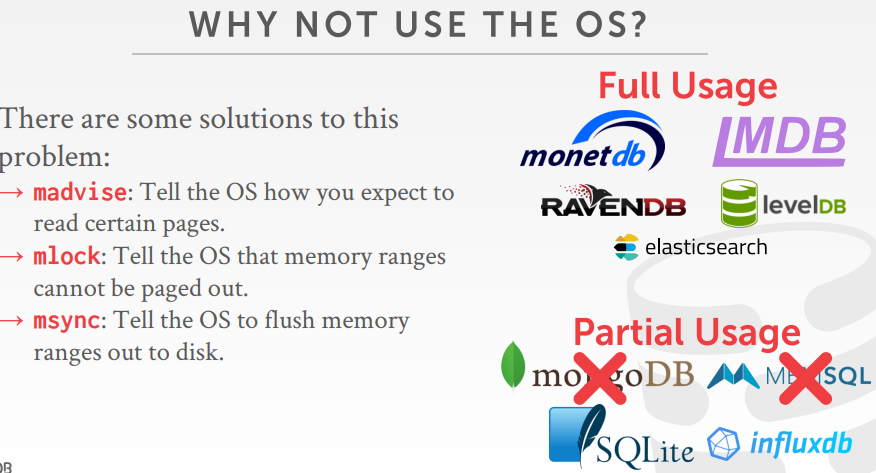  
所以我们不希望操作系统干预数据库系统的决策，我们希望可以自己控制东西使得事情做得更好。  
-	将脏页按照正确的顺序刷盘  
-	特定的预取规则  
-	缓冲区替换策略  
-	线程/进程的调度规则  

### 问题1：DBMS如何表示磁盘上文件中的数据？

#### 文件系统
DBMS在磁盘上用一个或多个文件存储一个数据库，更多的是用多个文件存，否则当数据量非常大时做错误恢复会用大量开销。OS不知道这些文件的内容。这些数据库文件通常存放在操作系统提供给我们的文件系统中，如Ex3，Ex4，基于操作系统提供的基本读写API来对文件读写。

#### 存储引擎
存储引擎负责维护在磁盘上的数据库文件 进行读写，并让OS进行调度工作，有些高端数据库系统会在文件系统上有一个shim层，允许数据库做一些磁盘调度。之后我们会将这些文件组织为一系列page，存储引擎跟踪我们在这些page上执行的读取、写入操作，跟踪这些page的剩余可用空间。

#### Database pages
固定大小的数据块。可以存储数据库中的tuple、meta-data、索引、日志记录等；一些数据库需要page是self-contained的，即所有的信息都需要知道如何去解释、使用。

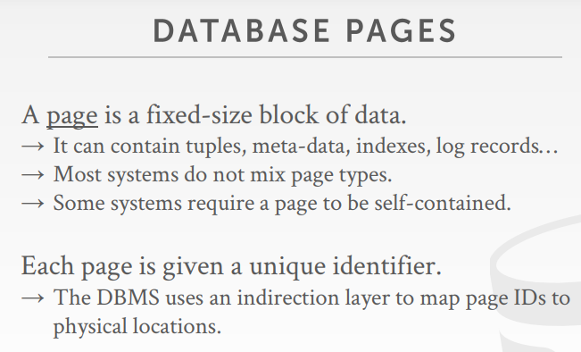  

有些数据库系统，数据库的metadata和tuple分开在不同page中，这样一旦存放metadata的page丢失，数据库就恢复不出来；有些系统就会把描述该page内容的所有metadata和内容一起保存在page中，这样即使部分page丢失，也不影响其他page的恢复，可以通过一个十六进制编辑器(恢复数据库神器)尝试通过一次查看一个page来试着重建数据库。

所以一般来说，我们不会在page中混合使用不同类型的数据，如一些page专门放tuple，一些专门放log，一些专门放index。

此外，DBMS会有一个indirection层，帮助我们将一个page ID映射到某个文件中的某个物理位置上。  

在DB中有三种不同概念的page：  
1.	Hardware page 通常4KB，从实际存储设备本身获得的page相关的API或访问级别    
2.	OS Page 通常4KB，从实际存储设备中取出放入内存  
3.	Database Page 512B-16KB  

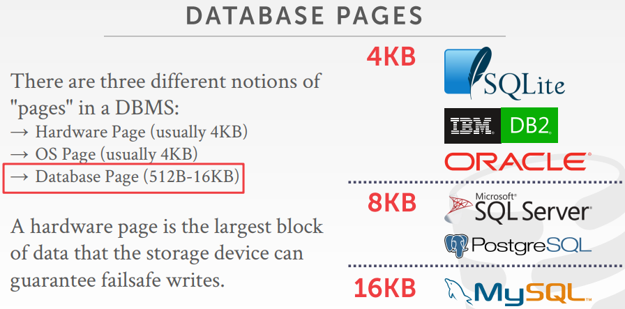  
Hardware page是执行原子写入存储设备的最底层的单位，即若hardware page是4KB，则我们对磁盘做write、flush等，存储设备只能保证每次写入4KB时是原子的。

database page大小的设计是种trade-off，太大会因为写入操作可能对应于hardware的多个page而失去原子性，当存在单机失效等问题时数据恢复会变得更难；但page更大，则同等大小的directory可以代表更多的数据，对cpu的TLB来说能够减少cache miss

#### page storage architecture
-	Heap File Organization
-	Sequential/Sorted File Organization
-	Hashing File Organization  

我们不需要考虑页内部存放的是什么东西。

##### Heap file  
一系列无序的page，其中tuple以随即顺序存放。  
有API包括Create/Get/Write/Delete Page，同时支持便利每个page。
需要metadata来跟踪每个page和page是否空闲等信息。
 
两种表达heap file的方式：Linked list；Page Directory。  
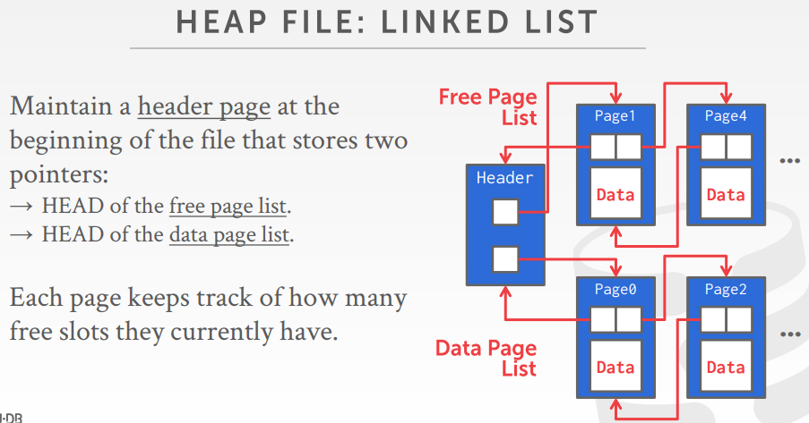  
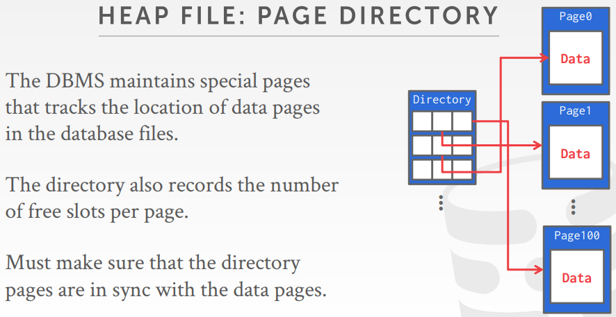  

#### Page header 

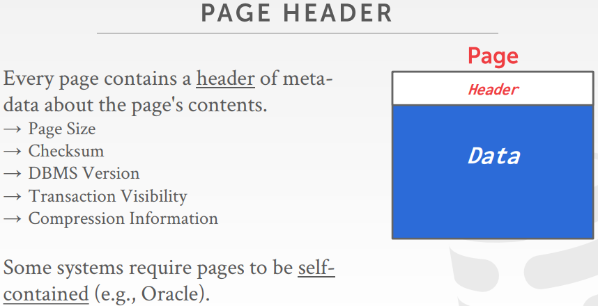

#### Page layout
如何组织存放在page中的data？两种方案：  
1. tuple-oriented  
2. log-structured

-	若采用tuple storage，若每个tuple长度不相等，会产生空间碎片，多次delete之后，整个page的tuple会变得很琐碎  
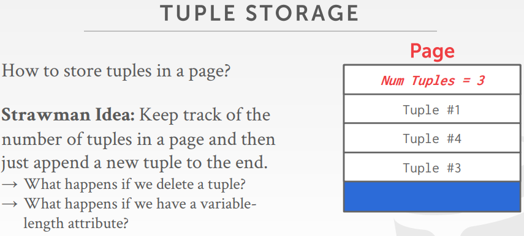

-	现代数据库系统通常采用slotted pages，通过slot array记录每个tuple在page中的offset，slot从前往后填充，tuple从后往前填充。page id + slot确定tuple     
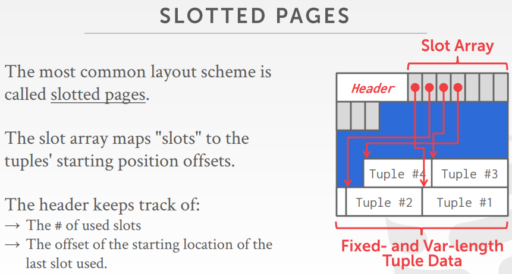

我们可以通过vaccum(Postgresql中的一个操作，用于整理数据库)或者压缩来对数据库进行扫描并整理碎片。一般来说，一个page内的tuple都来自同一张表，很少系统会将不同表的tuple放到一起

#### Record IDs
我们怎么知道某个tuple在哪个slot中？   
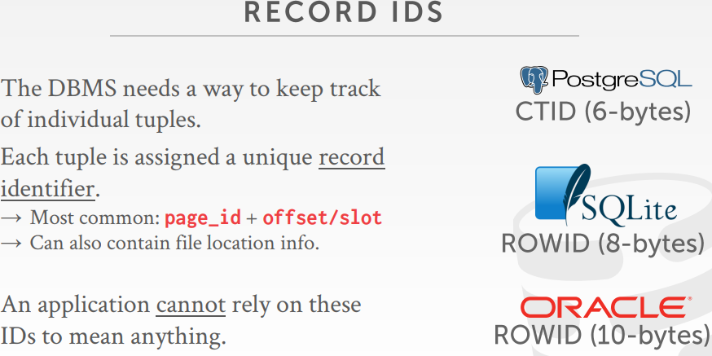  
通过tuple id或record id来识别tuple，它是一个唯一标识符，用于表示一个tuple的逻辑地址，通常情况下，使用page id + offset/slot来表示该标识符。故我们查找tuple，实际是在知道page id和slot的情况下在pages中寻找

##### 查看record id
-	postgresql: SELECT r.ctid, r.* FROM r; 默认在最后插入，可调用vaccum整理page(VACUUM FULL;) 
-	sql server: SELECT sys.fn_PhysLocFormatter(%%physloc%%) AS  [File:Page:Slot], r.* FROM r; 更新page时会尽量让page紧凑  
-	oracle: SELECT rowid, r.* FROM r; 同postgresql，不进行压缩

#### Tuple layout
tuple由一串字节构成，DBMS解释这些字节的意义  

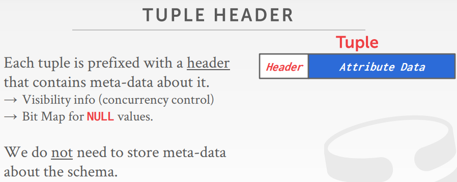  
通过header来跟踪一些东西，如vis信息，例如哪个事务查询修改了这个tuple；我们也无须存储tuple结构的元数据，这些更高级的元数据一般会保存在page里，或目录page里。

但是对于支持JSON或schema的数据库 如MongoDB，我们需要保存这种tuple结构，毕竟每条tuple或者记录都可能有不同的类型  

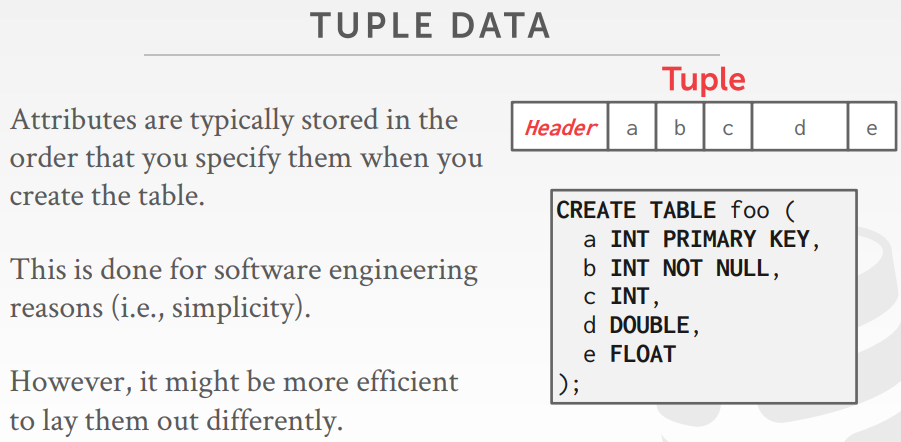

##### Denormalized tuple data
来自不同表的数据保存在同一个page中，通常是在对表进行反范式化设计，或对表进行pre join时，会出现这种类似情况。

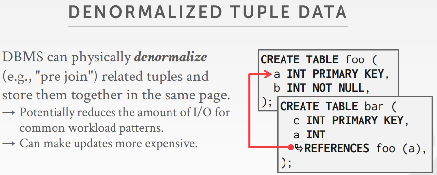  

反规范化，在join之前将tuple包装在一起。这是唯一的会将来自不同表的tuple存储在同一个page上的时候。  

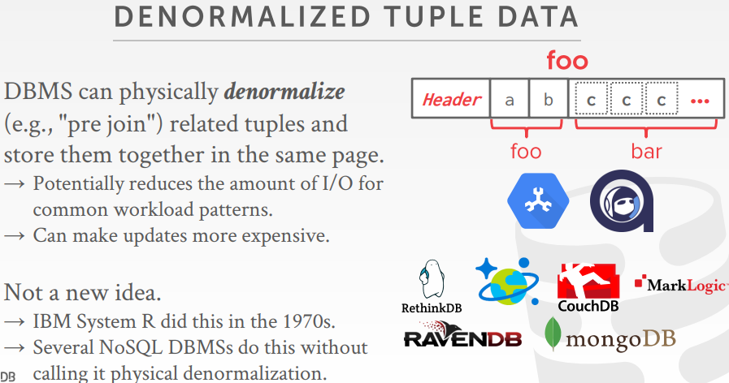 