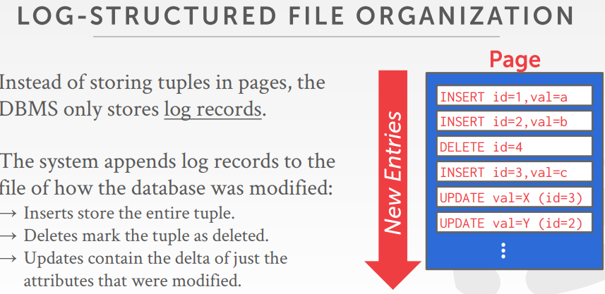
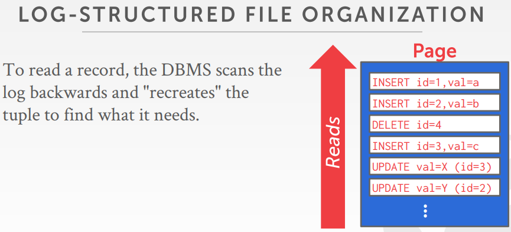
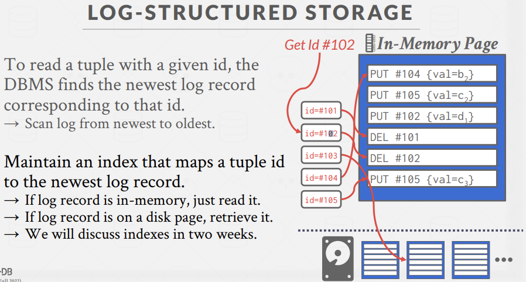
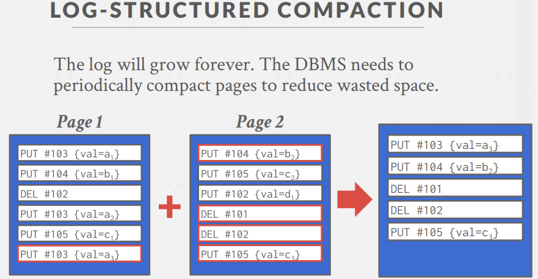
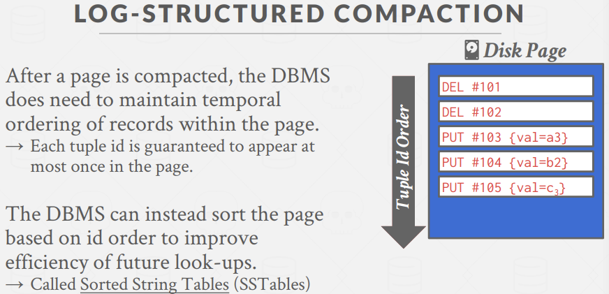
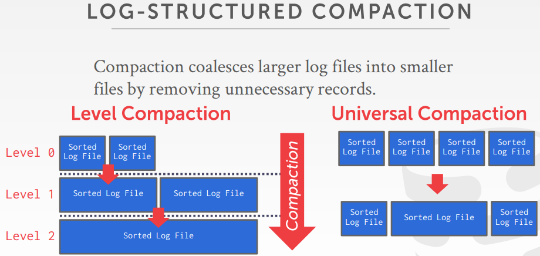
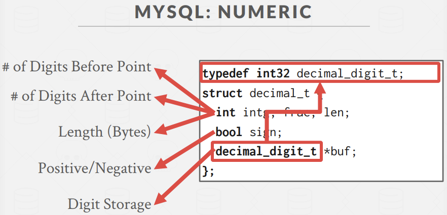
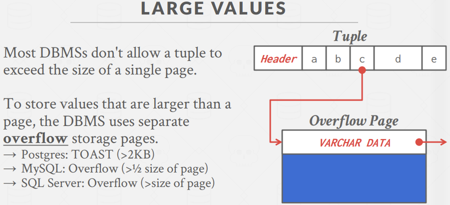
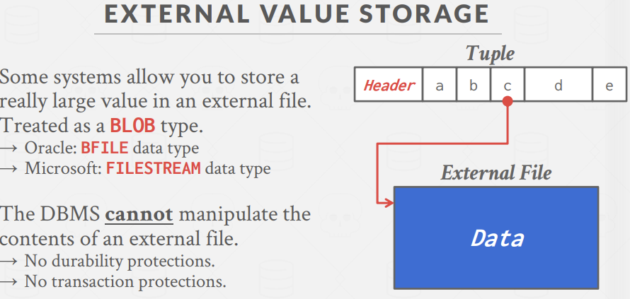
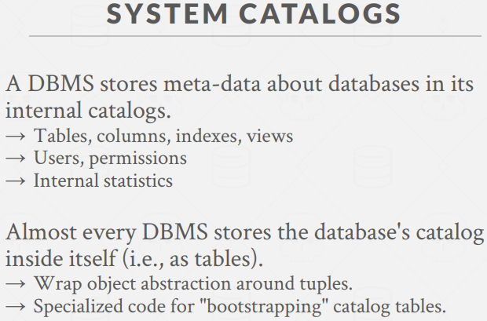

### Disk-oriented architecture

#### Page layout

上节课谈到page布置的两种主流方案： tuple-oriented、 log-structured，并围绕tuple在page中的存储展开了讨论。现在讲的是log-structured组织方案，page存储的是如何创建tuple以及修改tuple的相关信息。

例如insert、delete、update。这方便做rollback，且顺序append比随机访问快得多。但是若我们要读取某个tuple，我们需要在日志中回头扫描，找到该tuple在哪、它的最终结果是什么。

  

  

一些方式可以加速查询：  

-	可以建立索引来加速查询  
-	重新扫描log，对内容进行筛选压缩，对于每个tuple，仅需要一条记录即可  

  

 

需要分布式数据库系统都使用了这种技术如CockroachDB使用RocksDB存储管理器作为底层管理。  

在压缩方式上，通常有level compaction层级压缩和universal compaction全局压缩。这里在实际工程中需要讨论两个问题： 
 
-	写放大  
-	压缩成本    

#### Data representation
前面谈到DBMS的catalog包含关于table的schema信息，系统可利用这些信息来弄清楚tuple的布置。  

数据具体的表达方式，有以下几种：  

-	INTEGER / BIGINT / SMALLINT / TINYINT  
	*	C/C++ representation  
-	FLOAT / REAL vs. NUMERIC / DECIMAL
	*	IEEE-754二进制浮点数算术标准 / fixed-point decimals定点数
-	VARCHAR / VARBINARY / TEXT / BLOB
	*	对于可变长的数据类型，采用Header with length形式，后面跟data bytes，像BLOB，后面还会跟一个checksum
-	TIME / DATE / TIMESTAMP
	*	不同数据库实现差异很大，一些系统在unix中采用32/64-bit integer of (micro)seconds since Unix epoch(1970年1.1)

对可变精度数字，如FLOAT，REAL/DOUBLE，采用C/C++类型，即直接以IEEE-754标准存储。可变精度数字执行操作的速度比任意精度数字快得多，因为CPU有能够高效执行这些操作的指令，通过一条指令就能对两个浮点数进行相加减。但带来的问题是可变精度存在舍入误差。

为了避免误差，也有固定精度数字(fixed precision numbers)，如NUMERIC、DECIMAL，在舍入误差无法接受时被使用，如银行账户，这需要数据库自己实现这块代码。通常存储方式为 带有额外的meta-data的精确可变长度的二进制表示中，这就像VARCHAR不会用string存储一样。

不同的系统一般都有将本地磁盘的数据文件导入到数据库中的指令，如postgreSQL中的copy，sql server中的bulk，mysql中的load。  

如MySQL实现的NUMERIC：  

##### large values
可能存在某些特殊场景，一个tuple无法放在单一page上，第一种方案，可以通过overflow page来解决问题。如c VARCHAR太大，利用一个指针指向该overflow page，page中存放该varchar data；若该page仍放不下，可以链接其他page，链接在一起从而得到我们想要的输出结果。这通常以BLOB格式存储，即可变长的二进制大型对象。  

  

这种大tuple一般在只读 或者 以读为主的场景较为适合，如维基百科，我们可以去更新一篇文章或一个条目，但大部分时候，我们对它只进行读操作，故将它从磁盘中取出并存入内存时，可以将它进行压缩，因为大部分时候我们都无需将它解压进行更新。

另一种方案：外部存储。基本思路是，不讲该属性的数据保存在tuple内部，而是往里面保存一个指针或者一个文件路径，指向该数据的本地磁盘 或网络存储 或某些外部存储设备。但这种方案下，我们只能读取数据，不能操作数据，这超出了我们数据库系统的控制范围或保护范围。常见的，如GB级的视频文件。

#### System catalog
很多DBMS会将它们的catalog用另一张表来保存。大部分数据库系统会通过INFORMATION_SCHEMA这个api把catalog暴露出来。在MySQL中，可以通过SHOW databases; SHOW TABLES; DESCRIBE student; 等指令查看表信息。

