### Disk-oriented architecture

#### Page layout

上节课谈到page布置的两种主流方案： tuple-oriented、 log-structured，并围绕tuple在page中的存储展开了讨论。现在讲的是log-structured组织方案，page存储的是如何创建tuple以及修改tuple的相关信息。

  
例如insert、delete、update。这方便做rollback，且顺序append比随机访问快得多。但是若我们要读取某个tuple，我们需要在日志中回头扫描，找到该tuple在哪、它的最终结果是什么。

  

  

一些方式可以加速查询：  

-	可以建立索引来加速查询  
-	重新扫描log，对内容进行筛选压缩，对于每个tuple，仅需要一条记录即可  

  

  

需要分布式数据库系统都使用了这种技术如CockroachDB使用RocksDB存储管理器作为底层管理。  

在压缩方式上，通常有level compaction层级压缩和universal compaction全局压缩。这里在实际工程中需要讨论两个问题： 
 
-	写放大  
-	压缩成本    

#### Data representation
前面谈到DBMS的catalog包含关于table的schema信息，系统可利用这些信息来弄清楚tuple的布置。  

数据具体的表达方式，有以下几种：  

-	INTEGER / BIGINT / SMALLINT / TINYINT  
	*	C/C++ representation  
-	FLOAT / REAL vs. NUMERIC / DECIMAL
	*	IEEE-754二进制浮点数算术标准 / fixed-point decimals定点数
-	VARCHAR / VARBINARY / TEXT / BLOB
	*	对于可变长的数据类型，采用Header with length形式，后面跟data bytes，像BLOB，后面还会跟一个checksum
-	TIME / DATE / TIMESTAMP
	*	不同数据库实现差异很大，一些系统在unix中采用32/64-bit integer of (micro)seconds since Unix epoch(1970年1.1)

对可变精度数字，如FLOAT，REAL/DOUBLE，采用C/C++类型，即直接以IEEE-754标准存储。可变精度数字执行操作的速度比任意精度数字快得多，因为CPU有能够高效执行这些操作的指令，通过一条指令就能对两个浮点数进行相加减。但带来的问题是可变精度存在舍入误差。

为了避免误差，也有固定精度数字(fixed precision numbers)，如NUMERIC、DECIMAL，在舍入误差无法接受时被使用，如银行账户，这需要数据库自己实现这块代码。通常存储方式为 带有额外的meta-data的精确可变长度的二进制表示中，这就像VARCHAR不会用string存储一样。

不同的系统一般都有将本地磁盘的数据文件导入到数据库中的指令，如postgreSQL中的copy，sql server中的bulk，mysql中的load。  

如MySQL实现的NUMERIC：  
  

##### large values
可能存在某些特殊场景，一个tuple无法放在单一page上，第一种方案，可以通过overflow page来解决问题。如c VARCHAR太大，利用一个指针指向该overflow page，page中存放该varchar data；若该page仍放不下，可以链接其他page，链接在一起从而得到我们想要的输出结果。这通常以BLOB格式存储，即可变长的二进制大型对象。  

   

这种大tuple一般在只读 或者 以读为主的场景较为适合，如维基百科，我们可以去更新一篇文章或一个条目，但大部分时候，我们对它只进行读操作，故将它从磁盘中取出并存入内存时，可以将它进行压缩，因为大部分时候我们都无需将它解压进行更新。

另一种方案：外部存储。基本思路是，不讲该属性的数据保存在tuple内部，而是往里面保存一个指针或者一个文件路径，指向该数据的本地磁盘 或网络存储 或某些外部存储设备。但这种方案下，我们只能读取数据，不能操作数据，这超出了我们数据库系统的控制范围或保护范围。常见的，如GB级的视频文件。

#### System catalog
很多DBMS会将它们的catalog用另一张表来保存。大部分数据库系统会通过INFORMATION_SCHEMA这个api把catalog暴露出来。在MySQL中，可以通过SHOW databases; SHOW TABLES; DESCRIBE student; 等指令查看表信息。

### Database workloads
-	On-Line Transaction Processing(OLTP)
	-	Fast operations that only read/update a small amount of data each time
-	On-Line Analytical Processing(OLAP)
	-	Complex queries that read a lot of data to compute aggregates
-	Hybrid Transaction + Analytical Processing
	-	OLTP + OLAP together on the same database instance

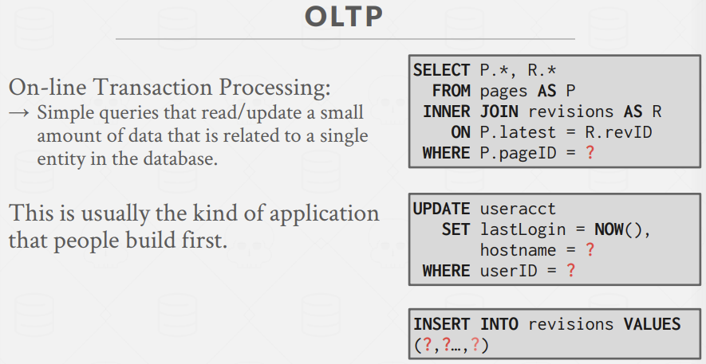  
OLTP通常查询很简单，只会读取或更新一小部分数据，如淘宝。  

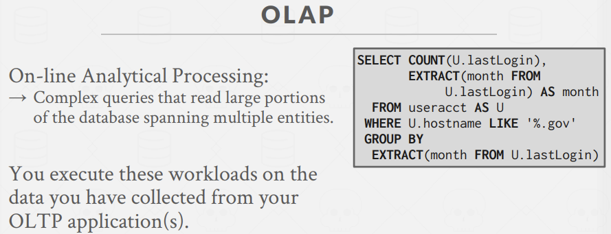  
经常被用于根据已有数据库做分析，派生出新的信息。  

故通常而言，workload复杂度上，OLAP远复杂于OLTP，OLTP擅长简单的查询，但是会做大量的写入操作。处于这两种中间的就是HTAP。  

此外，NoSQL和NewSQL的区别不等于OLAP和OLTP。对于传统的NoSQL系统如MongoDB、Cassandra、Redis，它们属于OLTP那块，我们主要在它们里面塞入新数据；尽管MongoDB支持某些分析，但也并没有列存储，所以我们也不会想在MongoDB上做些硬核的分析。  
NoSQL在2000年末提出，谷歌推出了HBase系统，以及BigTable、Hadoop，它们不执行SQL，也不做事务处理或者join操作，这也是它们能拓展的原因，Hadoop具备在线分析处理(OLAP)的能力，BigTable、Cassanddra、MangoDB具备的是OLTP的能力。

#### N-ary storage model
DBMS可以用不同的方式存储tuple，从而更好应对不同的OLTP或OLAP workload。  
行存储，即n-ary storage model，基本思路是将单个tuple的所有属性连续地存储在page中，对于体积较大的对象，我们可以使用overflow page，但一般来说，它们都需要被对齐。所以这类行存储很适合OLTP，因为我们要访问的数据量在粒度上足够的小，倾向于访问单个实体，像一个用户只需要他自己的购物记录等信息，而不关注其他人的信息。  

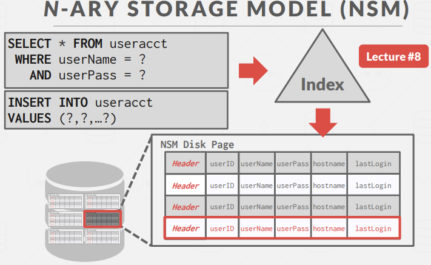  
对于这种查询场景，通过索引找到tuple，只需要读取单一page即可获取所有所需的信息，所以让一个tuple的所有数据连续地放在一起读取是最有效的方式。  
对于插入也是，我们只需找到一个空闲slot，将所有数据一次性写入，接着将它刷入磁盘，并记录日志。  

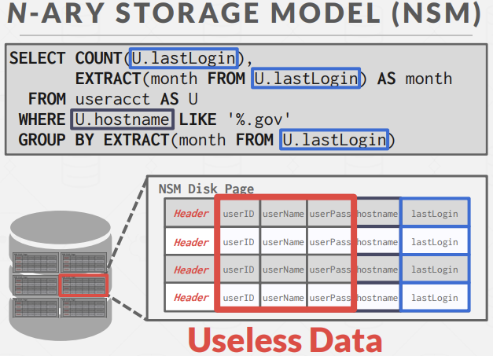  
但如果我们要统计每个月政府员工登录平台的次数。这需要遍历整个table，涉及多page，但是为了执行这条query，不得不获取很多不去访问的列。  

故NSM即行存储模型中，当我们访问整个tuple时，insert、delete、update速度很快，对那些需要获取整个tuple的query来说也很友好；但当我们要进行一些分析型查询以及OLAP工作，需要我们扫描整张表大部分内容时，NSM会体现的很糟糕，因为我们要往内存中换入一大堆我们用不到的属性。

#### Decomposition storage model
DBMS将所有tuple的某一属性连续存放在page中，即DSM列存储模型(column store)。这对OLAP来说很友好，我们只需读取表中部分属性的集合即可。

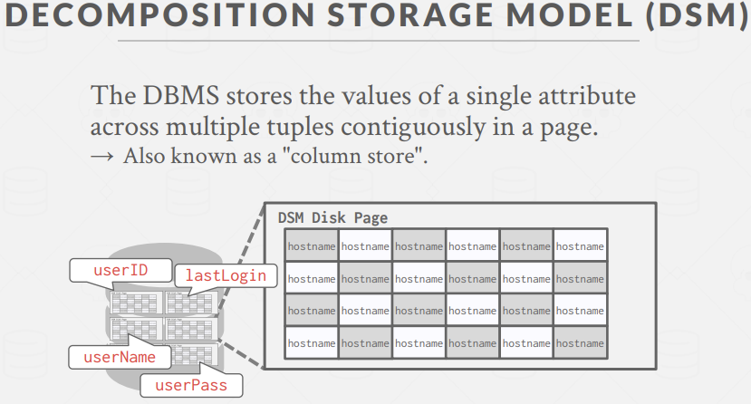  
对上述query，我们根据WHERE先拿到hostname所在的page，扫描每个hostname并作条件判断，随后我就获得了一系列hostname的tuple，接着将lastlogin所在的page放入内存，最后生成结果。  

在此基础上，因为我们知道一列中的数据类型都一模一样，我们可以运用压缩技术，这样单个page只能放1000个tuple，在进行压缩之后可能能放上10000个tuple。

##### tuple identification
其中涉及的一个问题是：我们该怎样从一个page中找到一个匹配项，匹配上另一个page中的对应项？  

第一种方案是，使用固定长度的偏移值，这意味着对一列中的每个值来说，它们的长度始终是固定的，这样通过简单的算术运算就能获得rowid，从而进一步获取page number或slot number等信息得到数据。  
但在第一种方案下，若处理的数据是变长字符串等，可能会采取压缩为一个固定长度的数据，字符串填充等手段来满足长度一致。  

第二种方案是，对列中的每个值，我们会为每个值都保存一个主键或标识符。这是非常浪费空间的做法。  
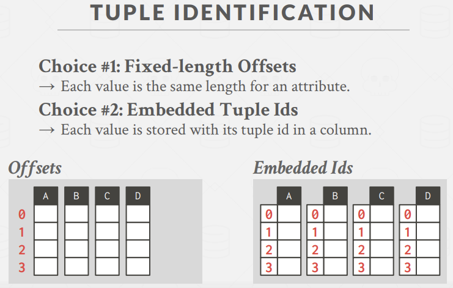  

故DSM在优势在于，当我们做OLAP查询时，我们可以降低I/O次数，因为DBMS仅读它需要的数据；在查询处理上，性能更好，也有数据压缩手段。  
DSM的劣势也很明显，读一整个tuple的时候会很慢，因为我们不得不把不同列的数据拼接起来获得一个完整的tuple，这和行存不一样。对点查、insert、update、delete也不够友好，因为所有的列都分开了，这会由于tuple splitting/stitching带来更多次的操作。  

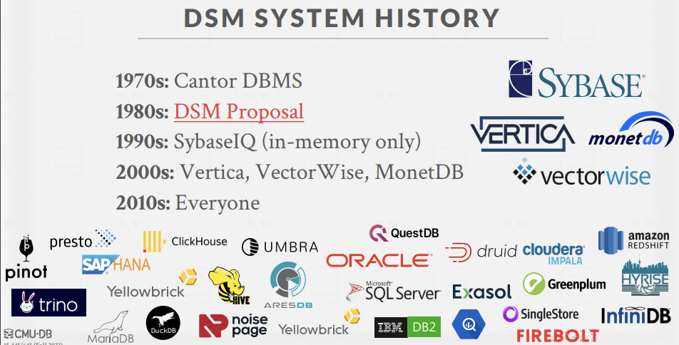  

#### Observation
若DBMS在query execution期间需要从磁盘fetch数据，I/O是主要瓶颈。  
DBMS可以压缩page来提升每次I/O操作所移动的数据使用量。  
这中间的关键trade-off在于提升速度vs.压缩比例，因为压缩对内存友好，但是未必对CPU友好，压缩和解压占用CPU。  

在真实案例中，数据集往往具有高度倾斜的属性值分布，数据集倾向于在同一元组的属性之间具有高度相关性。

#### Database compression
目标1：能够产生定长数据(fixed-length values)  
因为我们希望根据offset就能够跳转到具体tuple。唯一的例外是可变长数据如BLOB、VAR-BINARY，我们需要有单独的一组page去存储他们的指针

目标2：在query execution期间，尽可能的去推迟解压  
即数据库系统应尽可能地直接操作已压缩数据，也被称为late materialization(物化)  

目标3：确保方案是lossless的  
确保解压后的数据没有失真，任何lossy压缩应该在应用层被执行  

##### compression granularity
1.	block-level
	-	为同一table中的一块tuples压缩  
2.	tuple-level
	-	NSM-only，压缩一整个tuple的内容  
3.	attribute-level
	-	压缩一个tuple中的某一属性(overflow)  
	-	压缩相同tuple的大量属性  
4.	column-level
	-	DSM-only，对大量的tuples的某一个或多个属性值做压缩	

传统压缩技术有LZO、LZ4、Snappy、Zstd、Oracle OZIP、gzip，主要考虑的点是计算费用、压缩和解压的速度。  

以MySQL为例，我们知道MySQL默认page size是16KB，压缩后的page大小可能不固定但一般会取2的次幂。当要读取某一page时，该页可能已被压缩，但依然会原封不动的放入到内存中，当有写入操作时，如update、insert等，它们可能是不需要获取具体信息的操作，我们可以直接把这样的操作append到mod log。之后有任何query，可能就可以直接根据mod log给出答案而不必解压page
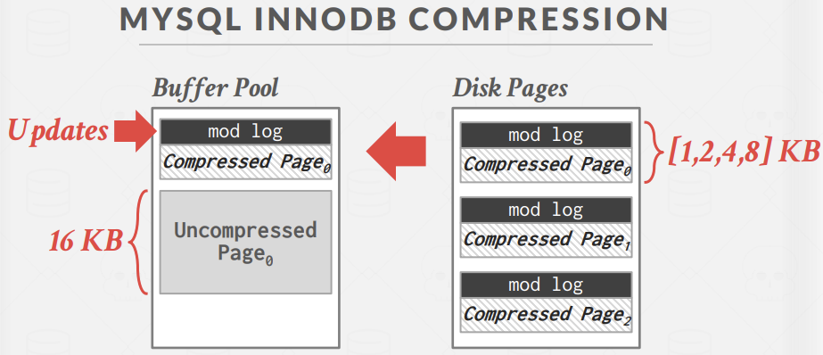  

故使用传统压缩技术时，DBMS必须要在读或修改之前解压数据，这样的传统压缩技术不会考虑high-level意义或数据的语义。

##### observation
所以我们会希望DBMS能够还没解压就直接操作已压缩的数据  
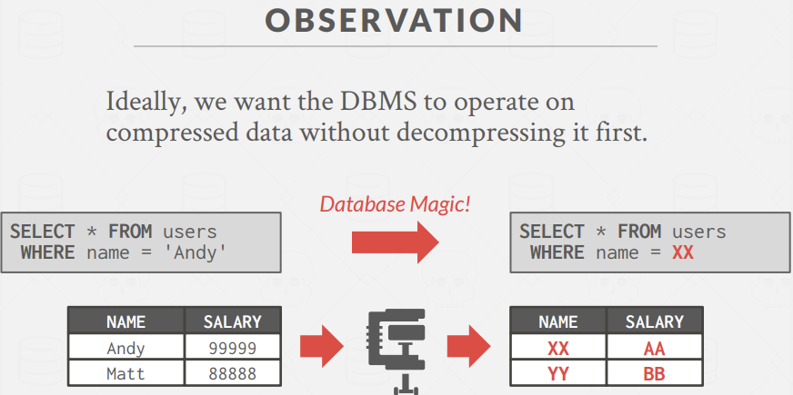  

##### columnar compression
-	run-length encoding
-	bit-packing encoding
-	bitmap encoding
-	delta encoding
-	incremental encoding
-	dictionary encoding

1.run-length encoding  
保存一个三元组(值,起始下标,重复次数)，这需要列有一个比较好的排序来最大化压缩比例，如sex列，若值为图中所示，会比值为M,M,M,M,M,M,F,F压缩起来占更多空间      
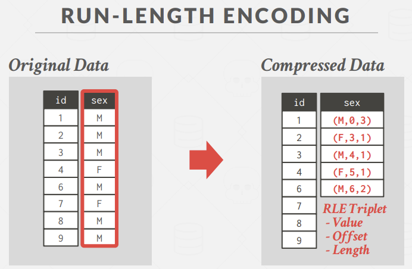  
执行SELECT sex, COUNT(*) FROM users GROUP BY sex;这样的语句时，就能不解压而直接获取结果。  

2.bit-packing encoding  
当某一属性的值总是比它声明的最大size小很多时，可以将它们替换为更小的size来存储。  
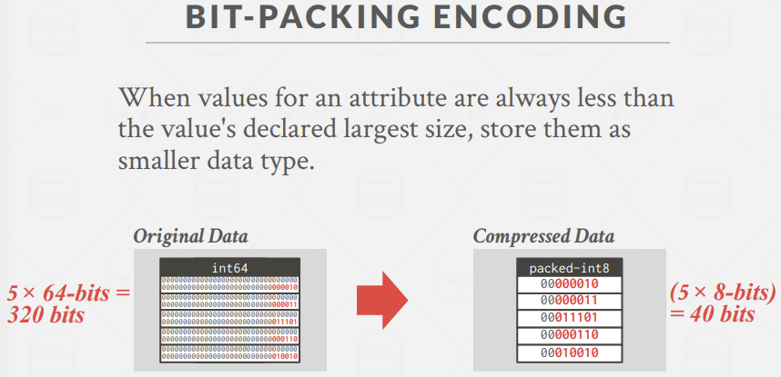  
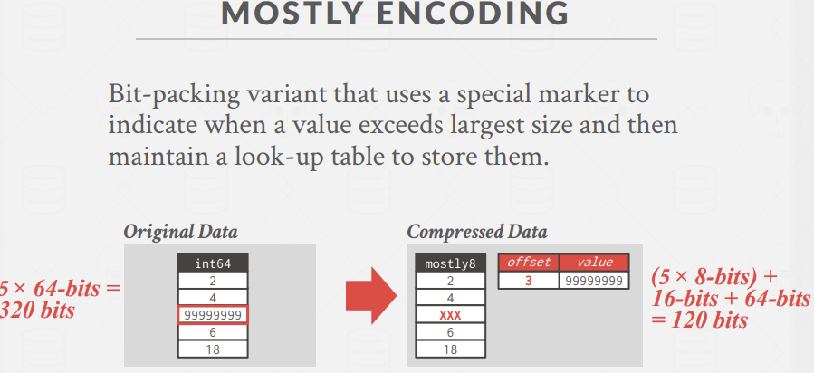  

3.bitmap encoding  
为属性的每个唯一值存储一个单独的位图，其中向量中的偏移量对应于一个元组。  
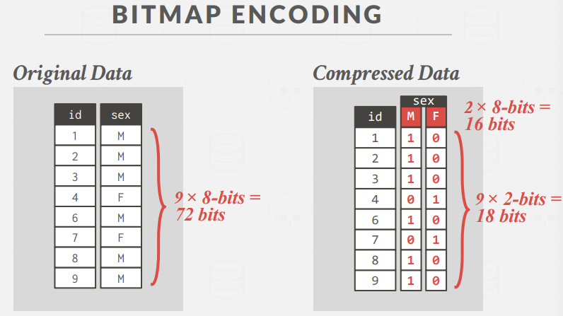  

4.delta encoding  
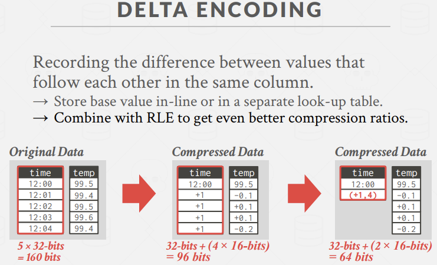  

5.incremental encoding  
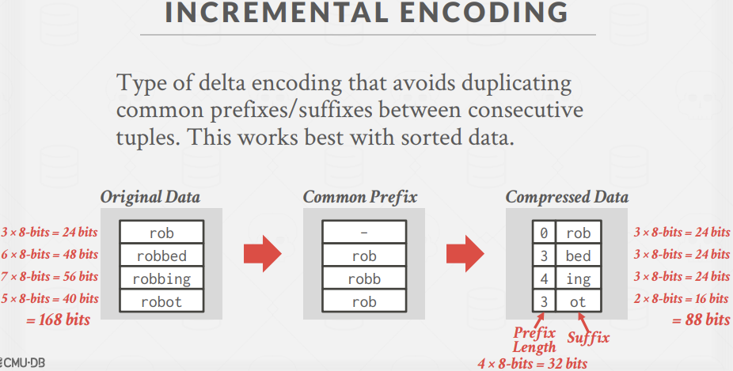  

6.dictionary compression  
构造数据结构，描述从可变长值到更小的整型标识符之间的映射。随后将那些值替换为对应的id。  

-	需要支持快速的编码和解码
-	需要支持range query  
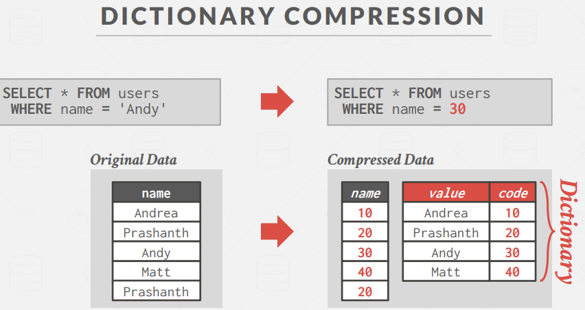  

这样的数据结构就称为字典。这本字典应该需要支持两种操作：  

-	Encode/Locate: 对一个未压缩的值，将其转换为压缩后的值。  
-	Decode/Extract: 对一个已压缩的值，将其转换为未压缩的初始值。   

让初始值有序编码，在范围查找时有好处
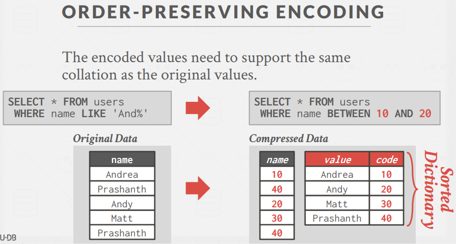  

要注意到的是，有些情况下可以直接根据字典获取最终结果，有时仍需要根据字典扫描列  
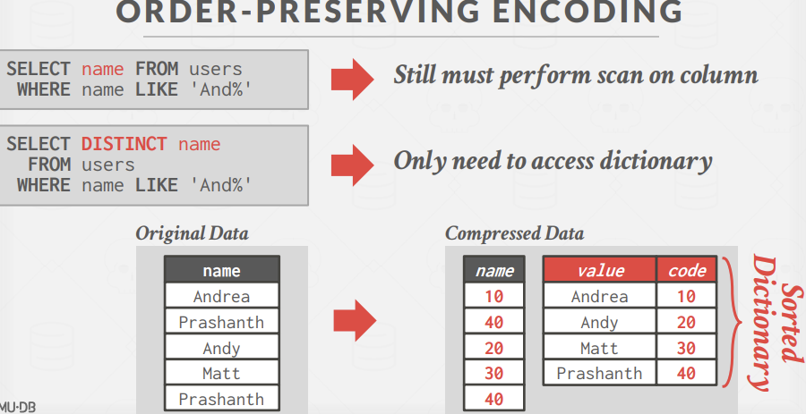