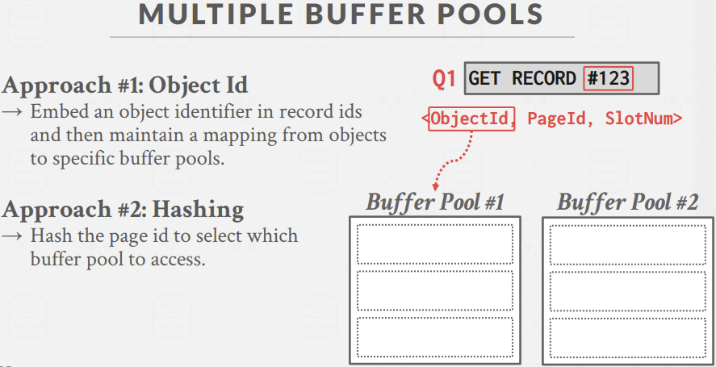
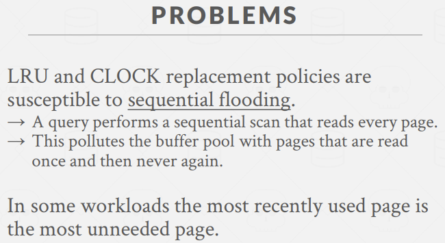

### Databse storage
之前我们讨论了第一个问题，即DBMS如何在磁盘上表示数据库。现在我们关注第二个问题，如何让DBMS管理内存并让数据在内存和磁盘之间换入换出？  

  
在空间管理方面，我们需要考虑将page放在磁盘的什么位置。因为我们希望，我们可以将那些访问频率更高的page在物理位置上更接近，如果它们是一个一个挨着放的，我们就不需要花很长时间在磁盘上找到这些不同的位置。  
在时间管理上，我们需要决定什么时候把page写入磁盘，并且在某些时候它们被修改了，我们要将它们写回磁盘。总体目标就是尝试最小化访问磁盘读取数据的次数。  

总体工作思路如下图，由执行引擎请求page，bp中会预先加载directory，之后会根据该目录从磁盘fetch该page，这之间若bp空间不够，还存在对其他page的换出，最后返回给执行引擎该page的指针。   

### Buffer pool organization
  
本质上讲，buffer pool需要我们在数据库系统内分配一块很大的内存区域，如调用malloc拿到一些内存块，然后把我们从磁盘中读取到的page放入里面，这段内存完全由数据库系统控制而不是OS。  
之后我们将这段内存区域分成一个个固定大小的chunk，被称之为frame。bp可以在内存中以任意的顺序存放page，所以我们需要一个额外的indirection层，告诉我们某个特定的page映射在某个frame中。  

  
我们称这样的映射表为page table，实质为一个hash表，用来跟踪我们在内存中有哪些page，通过page id和page table可以获取对应frame。  
所以数据库系统中还需要保存一些给每一页的meta-data，以此来跟踪当前bp中的page发生了什么，首要的是dirty flag。  
其次是引用计数，用以跟踪当前使用该page的线程数量或者是正在查询该page的数量。  
当我们要做更新，我们拿到page放入bp，从该page被放入内存到对它进行更新前，我不想让该page被evict到磁盘，这也将阻止我们去移除那些还未被安全写回磁盘的page。  
我们还需要做一些额外的事情，以此来跟踪哪些page被修改、谁进行了这项修改，所以我们会通过日志来记录修改，这就要确保日志先写完后再改page。所以mmap在DBMS并不好用，因为无法保证OS在将page写磁盘前不去做这些事。  

#### Locks vs. Latches  
  
在数据库系统中，lock是某种更高级的逻辑原语，它会去保护数据库中的逻辑内容，如tuple、表、数据库，事务会在执行的时候持有这个lock。  
latch是一种底层保护原语，我们使用它来保护数据库系统内的关键部分，例如保护数据结构、内存区域，如修改page table，我们会在要修改的地方加上一个latch，修改完后将它释放。  

#### Page table vs. Page directory  
  
简而言之，page directory的作用是找到page在数据库文件中的位置，将page di映射到磁盘上的具体位置。故我们对page directory所做的所有改变都必须持久化到磁盘，如果系统崩溃了，恢复后我们想要知道该在哪里找到我们拥有的page。  
page table是内存中的映射，将page id映射到bp中frame的位置，故这个数据结构是暂时的，不需要在磁盘上做备份，因为当系统崩溃，我们的bp里的数据就没了，不需要在意page table还在不在。这意味着用hashmap、hashtable、std::map等实现都没问题，因为我们不需要保证它持久化，只需要保证它线程安全。   

#### Allocation policies  
接着我们需要为数据库中的bp分配内存。  
第一种方式，我们称为全局策略，即我们试着做出的决策能使整个要执行的workload都受益，我们会去查看所有运行在该系统上的查询和事务，以及选择某些数据是否应该在内存中等。  
第二种方式就是局部策略，即针对每个单个查询或者单个事务来执行，尝试执行让这单个query或单个txn执行地更快的方案，即便对整个系统而言这可能是一个糟糕的方案。  
大多数系统会兼顾这两种策略，在lab1中使用全局策略更好。比如采用类似LRU策略，替换page时找到最近最少使用的page将它移除的方式。  
   

### Buffer pool optimizations
下面会谈到一些bp优化方案。有多bp、预取策略、scan sharing扫描共享、buffer pool bypass。  

#### Mutiple buffer pools
采用多bp的好处是 减少锁争用，提升局部性，为放入bp的数据做量身定制。  
如bp0处理索引，bp1处理表，我们就可以针对它们使用不同的策略。  
我们可以指定bp数量，然后对于给定的page id，它们会通过round-robin hash来判断我要找的数据在哪里，它放在了哪个bp。  
  

有两种方式来使用多bp。  
第一种方式，bp通过将数据库对象的record id维护管理起来，来管理数据库对象。  
  
第二种方式，也是mysql采取的方式，通过对传入的record id做hash，即对bp数量取模，就能获取想要的位置。  
  

#### Pre-fetching  
我们想要最小化数据库系统中的停顿。一种方式叫sequential scans，当系统从磁盘fetch page0、page1到bp中时，page0-5来自于同一张表，系统可能会意识到，这个操作是想要扫描整张表，那么在我们实际要获取page2、page3之前，系统就已将预先将它们塞进bp。mmap就有这样的功能。    
  

第二种情况，根据索引的扫描。很多在这种的情况下是OS无法作物测的。  
假设现有有一条查询 SELECT * FROM A WHERE val BETWEEN 100 AND 250;，我们已经对val做过索引。OS可能会在fetch page0、page1后自然地fetch2和3，但我们可以有策略的去fetch3和5。  
  

#### Scan sharing
我们可以有一些可以彼此利用的查询，并复用某个查询从磁盘中读取到的数据，将该数据用于其他查询。这不同于result caching，这指的是对于完全相同的query，之前缓存了它的答案，就可以再次展示。  
它的工作方式是，当我们允许多个查询attach到单个游标上时，扫描page并放入bp，查询之间未必需要相同，只要正在读取相同的page，我们就可以横跨不同的线程来共享这些临时结果。  
  
如果一个query做了一次scan，而DBMS意识到有另一个query也在做相同的scan，它就把第二个query的cursor附加到第一个查询的cursor上。  
  
如下有两个query，Q1已经扫描到page3把page0替换掉，这时Q2来了，若没有该技术，就会存在多次的相同page的先换出后换入的场景，大大增大了I/0次数。但是有共享扫描的支持，我们可以让两个query一同从page3往下继续扫描。等Q1做完，Q2再回到表头，扫描它自己还未扫描的page0、1、2。     
  
  

#### Buffer pool bypass
思路是，我们分配一小块内存给某个query的那个线程，然后当它读取page时，若不在buffer pool中，它就必须从磁盘中拿到该page，这里并不会把它放入bp中，而是将它放入本地内存，当查询结束，这些page就会被丢失。  
这么做是因为我们想要去避免在page table中进行查询所带的开销，它里面对每个page有latch，争抢latch要一定的代价。但只有当操作的中间结果和扫描的量不大时才行。  
  

### OS page cache
大多数磁盘操作都是通过最底层的OS API来做的，如fopen、fread、fwrite。默认情况下，OS会维护它自己的文件系统缓存，即OS page cache。这意味着，当我从磁盘中读取一个page时，OS会去在它的文件系统缓存(OS page缓存)中保存一份副本，然后我们就会在自己的buffer pool中有另一个副本。  
这显然是数据库系统不希望看到的，故大多数DBMS采用direct I/O，从而不让操作系统对某些文件做任何缓存处理，由我们自己来管理内存中的I/O。  
主流数据库系统中唯一依赖os page cache的是postgreSQL。  
  
在PostgreSQL中输入EXPLAIN (ANALYSE, BUFFERS) SELECT SUM(a + b) FROM testTable;，可以查看bphit、miss数量，查询计划、预估plan和execution时间等信息。执行这条query重启后，bp被清空，那么一般来说再执行这条query用时会和上次差不多，因为都是从磁盘读取所有page，但在postgreSQL中有文件缓存，使得部分os page被缓存过而加速query。  

这并不是想说依赖os page cache一定是好的，我们还是更希望自己管理bp。例如，我们此时用了os page cache，那么此时文件缓存和bp中都有某page的副本，这时我想修改这个page，dbms中的是新的page，os page cache中的是老page，这就变成了多余的数据。并且为了让数据库能跨OS使用，linux、windows等管理page方式不同，可能也会产生兼容性问题，又自己管理是最好的。    
在例子中，清空linux文件缓存的指令是 sync; echo 3 > /proc/sys/vm/drop_caches。  

### Buffer replacement policies  
DBMS中的page替换策略，通过腾成部分frame来塞入新的page，这关系到我们该从bp中evict哪部分page。  
目标： 

-	correctness。某个数据还被使用完，我们不想将它移出bp。
-	accuracy。确保我们移出的page是在未来不太会被用到的page，从而减少磁盘寻道数量。
-	speed。能够快速执行某些策略，因为当我们在page table中查询时会持有部分latch，我们不想长时间占用latch来弄清楚移除哪些page。
-	meta-data overhead。策略附带的meta-data尽量少。

#### Least-recently used
给每个page维护一个timestamp，记录该page最近access时间。  
evict page时，选择ts最旧的那个page。其中我们最好保持page 有序，这样能够有效减少evict时搜索时间。  

#### CLOCK
在bustub lab1中会用到的策略，类似于OS中的页面替换CLOCK算法，将page组织为环形buffer。  
各个page有一个ref引用位(1/0)，全局有一个扫描指针。access时page的ref置为1，扫描时若为1置为0，若为0淘汰。  
  

#### Sequential flooding
LRU和CLOCK替换策略都容易受到sequential flooding带来的影响。  
sequential flooding指的是顺序扫描page的query污染buffer pool。  
  
  

有三种方案来解决上述顺序泛洪问题。  
#### LRU-K
K代表对于单个page对应缓存数据的访问计数。  
我们会追踪每个page的最近K次access ts，并以此计算相邻access之间的间隔，以此来确定哪个page是最近最少被使用的。  

#### Localization
类似于使用多个bp，让每个查询本地化，互相不受到干扰。在这里，我们会统计对某个query/txn而言，最近最少使用的page，而不是从全局的角度看。  
  

#### Priority hints
DBMS知道每个page的内容，以此告诉bp每个page的重要性。  
当我们有索引的时候，我们知道查询是如何在这棵B+树里扫描的，也知道哪些page会被扫描。  
  

### Dirty pages
page上有个dirty位，告诉我们该page自从被放入bp后，是否有操作对该page内容进行了修改。  
  

#### background writing
为了解决上述问题，即避免必须立即将page写出以便在bp中腾出可用空间，而不得不阻塞的问题，我们可以进行后台写。也就是定期地扫描page table，将那些脏页flush到disk，并重置dirty或evict该page。    
  
这里需要注意的是，在该dirty page对应的修改操作写入日志前，我们不希望这样的dirty page被刷到磁盘上。也就是在写出dirty page之前，先确保已经将log records写出磁盘了。  

### 其他memory pools
