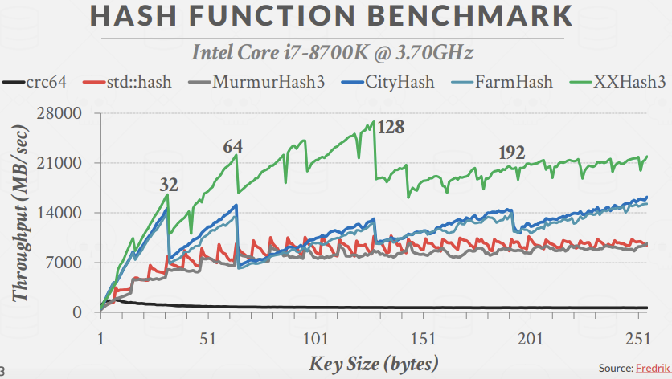
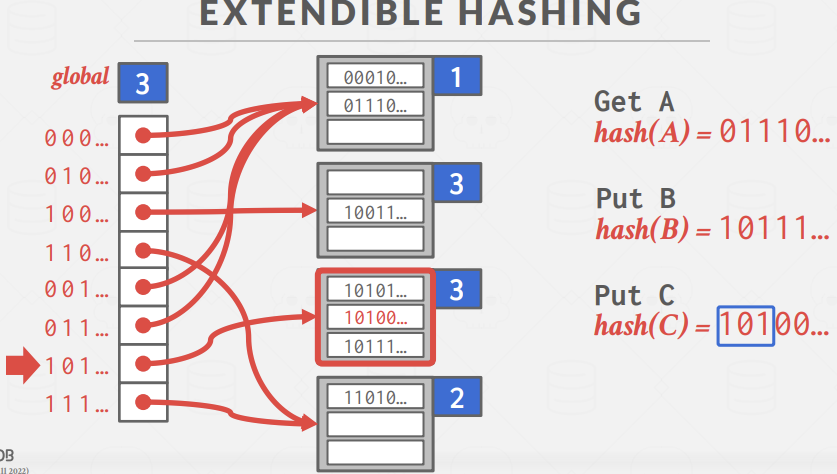

## 大纲

  
Access methods是一种我们用来对数据库的数据进行读写的方式。

### Design decisions
-	Data organization
	-	我们需要知道，我们该如何对放在内存或磁盘上的kv对进行表示，我们希望在每次更新数据结构时都不会进行大改 从而支持快速读写

-	Concurrency
	-	让多线程在同一时间访问数据结构而不产生问题

### Hash tables
  

考虑hash table设计时主要有两点。  
第一，hash函数的设计，这是hash运算速度和碰撞率之间的trade-off。  
第二，hash scheme，是当我们在hash table中遇上hash碰撞时，我们用来处理问题的机制，这是memory和compute之间的trade-off，也即分配大哈希表和find/insert冲突时额外操作间的trade-off。  
  
所以hash table就是由一个hash函数和hashing scheme所结合的产物

#### Static hash table
最简单的hash表了，一个巨大的数组，对每个元素分配了一个slot用以存储value。  
为了找到该元素，对key取模n来寻找到在数组中的偏移量。  
  
使用该方案基于几个假设，第一是我们能够知道elements的数量n并且n是固定的，第二是每个key都是unique的，第三是hash算法能够确保相同的key hash后路由到的offset不同，即没有碰撞，但目前还没有能完美避免碰撞的hash算子。

#### Hash functions
>对任意输入，返回一个32bit或64bit的hash值。  

  
CRC生成的数据的碰撞率合理，但是速度非常慢，实战中没人会使用。如今Facebook的XXHash有最好的生成速度和最低的碰撞率。  

  
可以从图中看到，当key的大小为32bytes或64bytes时，FarmHash、CityHash、XXHash3的图像都出现了尖峰，这是因为他们所进行计算处理的key都刚好填满单个cache line(cache line是CPU和主存之间数据传输的最小单位)

#### Static hashing schemes
在这种scheme下，我们需要知道hsh table的容量是多少。  

主要方案有：

1.	Linear Probe Hashing
2.	Robin Hood Hashing
3.	Cuckoo Hashing

##### Linear Probe Hashing
即open addressing，开地址法，它就是一个大型的slot表，如Python中的Dictionary使用的就是该方案。我们解决hash碰撞的方式是，当我们进行hash计算所得到的slot位置上已经有数据在上面了，我们就挨着这条数据往下扫描，直到我们遇到一个可以插入数据的空slot为止。  
  

但是删除时，可以会存在一定问题。当删除C时，向下扫描找到C并删除。但是当我查找D时，D通过hash路由到原本C所在位置，发现是空slot，从而以为D不在表中。  
  

有两种方案来应对delete带来的问题。  
方案1：tombstone(墓碑)。给C原来的位置放一个tombstone标记，表示该位置逻辑上被delete，可以在这里进行插入新key，需要定期地GC。  
  

方案2：movement。往下扫描，依次给下面的各个kv对移动位置，显然这方案很蠢，代价很大。  
  

####### Non-unique keys
在数据库中，我们不能保证key是唯一的。  
  
实战中，基本都会选择第二种做法。  

##### Robin hood hashing
罗宾汉哈希算法，即劫富济贫，是上述hash算法的变体，在此基础上，将rich key的slot转移给poor key。其中，poor和key描述的是number of positions(距离数)，即你所在的位置与你第一次进行hash所计算出的位置间的距离差。  
故在算法中，我们会试着对整个hash table进行平衡，让每个key尽可能靠近它原本所在的位置。  
  
  
  
它带来的移动代价比较高，实战中还是会选择上一种方法。

##### Cuckoo Hashing
使用多个hash table，每个hash table拥有不同的hash函数算子。实际使用时基本都是2个hash table，再往上就没有必要了。  
  
A发现两边都能插入，随意选择一边，或根据某种填充因子等做插入。B发现t1被占据，于是插入t2中。  
  
这时C插入时发现t1、t2都被A、B占据了。这时需要决定我们要杀死A还是B，这可以也是随机的。  
  
假设C把B给占据了。于是轮到B来重新插入。B发现另一个位置被A占了，于是B把A的位置占了。这时轮到A没有位置了。    
  
轮到A重新插入，A发现另一边还是空的，于是插入t2。  
  

#### 总结
对于静态hash table，我们需要知道table的大小，而且我们扩缩容时，需要重建整张表，迁移数据。  
由此对应的还有动态hashing schemes。  

1.	Chained Hashing
2.	Extendible Hashing
3.	Linear Hashing

##### Chained Hashing
维护一个包含buckets的linkedlist，通过将具有相同hash key的元素放入相同的buckets来解决冲突。像JVM中的HashMap采用的就是该数据结构。  
  

  

##### Extendible Hashing
将linkedlist逐步拆分，我们会对那些overflow的chain进行拆分，而不是将整个hash table拆分，届时多个slot位置可以指向同一个bucket chain。  
它的优势在于，当我们不得不移动数据时，我们只移动那些overflow的bucket，而不是移动所有bucket。  
  

首先，我们有一个global counter，统计bit的数量，通过hash函数，我们可以弄清楚我们要找的是哪个bucket或slot。同时，每个bucket chain也有一个local counter，它代表的数字是，我们需要看几个bit才能找到该位置。  
  
也就是说，通过global counter获取我们需要看几个bit，local counter是为了让我们找到要找的位置。  

  
此时Insert C，且Hash(C) = 10...时，该bucket发生overflow，所以我们要做拆分。  
将global counter加1变为3，则slot array长度从4变为8了，然后将该overflow bucket的local counter修改为3，拆分成两个counter为3的bucket。  
  
现在我们修改了global counter，就需要根据local counter，对slot array中的每个slot重新做映射。原来的0开头的bucket和11开头的bucket不做调整，设定指向它们的指针，而10开头的现在被拆分成为100和101开头的两个bucket，根据前缀自行指向不同的bucket。  
  
最后插入C。  
这里看出extendible hashing村咋一个性能瓶颈就是，我们做扩容时，需要获取slot array的latch以确保此时不会有读写进来。  

##### Linear Hashing
我们只需要重新分配那些溢出的bucket即可，所以我们不需要使用一个全局的latch来阻止所有人访问我们的hash table。  
  
不管bucket 0有没有overflow，每次发生overflow时，split pointer都是指向bucket 0。  
当执行Put 17时，bucket 1已满，发生溢出，于是创建overflow bucket，并且对split pointer当前指向的位置进行拆分。  
  
拆分过程为，给slot array新添加一个entry，hash函数修改为模2n，之后因overflow添加新entry时hash函数都不修改，直至容量到达2n。此时split pointer能够告诉我们在slot array中，我们所分割的距离有多远。  
之后我们将bucket0拆成两个，并将slot 4指向新bucket，之后split pointer下滑1。  
  

之后，当我们进行查找时，首先使用第一个hash函数，即基于0-3取模，如果我hash得到的结果在split pointer所在分界线之上，那说明我们查找的那个bucket被拆分了。接着就使用第二个hash函数，得到bucket 4且不在分界线之上。  
  

这其中基于的原理是，看似很多时候我们拆分的bucket并不是当前overflow bucket，但是最终随着不断的溢出，总能达到对溢出bucket的拆分。  
  

当通过delete使得某些bucket为空时，split pointer还能回退。  
  

  
以完全相反的操作执行上述操作。但是若执行的是Delete 6，那就只能保留那个空bucket。  