### Table indexes
对于大部分数据库中的数据结构，使用hash table就足够满足要求，因为基本像page table，replacer等做的都是点查。但是又有一些结构，仅仅使用hash table是不能很好的解决性能问题。  

#### Table indexes
表索引，是一张表中的属性的子集的一个副本，以一种更高效的方式进行按序存储，从而允许我们能够进行更高效的查找。  
因为表索引是表中部分属性的一个副本，故比较重要的一点是，我们需要保证表索引和表内容逻辑上是同步的(synchronized)。即如果我们更新了表中的一个tuple，则这个修改应该能够快速地反映到索引中(对表的任何更新都要同时去更新索引)。

DBMS的job之一就是对不同的表辨析出最适合它的索引、最高效的访问方法，来提升执行query时的效率。  
这是个trade-off，index的存在优化了query性能，但是带来了一定的开销，index的存储需要空间开销，index的维护需要开销，因为更新都需要被index同步执行。索引也是以page的形式存储，会保存在buffer pool中，当写出到磁盘时，又占用了磁盘空间。

#### B+ Tree
B: self-balancing，平衡的树结构，保持数据有序，在此基础下点查、扫描、插入、删除复杂度都在O(logn)。  
B+树最早是由人们试着去构建一种数据结构，它能够在磁盘非常缓慢并且内存有限的情况下进行高效的索引查询。相比于B树的特点之一是，当遍历到B+树底部的时候，我们可以沿着叶子节点进行扫描，于是就可以按顺序点查或是scan而无须回到根节点再次查找。  

B+树是M-way search tree。M代表除root外的其他所有节点的子节点最大个数。    

1.	完美平衡——所有叶节点具有相同的深度
2.	对除了root的其它所有节点，至少都是半满的，M/2-1 <= #keys <= M-1。
3.	每个内部节点由k个key和k+1的non-null children node组成。  

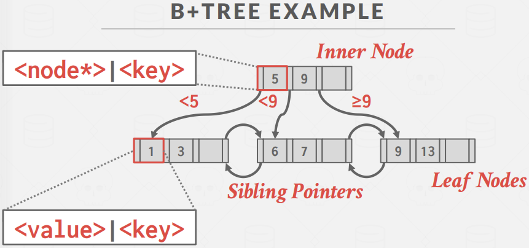  
对叶子节点来说，value可以是很多不同的东西，它可以是一个tuple的record ID，或是tuple本身等。非叶节点的value则是子节点的指针。  

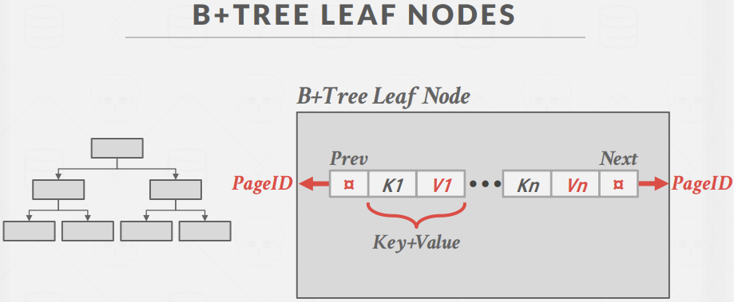  
叶子节点中通常保存的信息有多对的kv，以及指向前一个叶节点的pageId，后一个叶节点的pageId。  
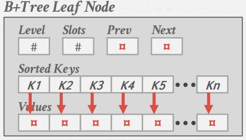  
实际存储时，一般会保存上图这些信息，除了key数组、value数组外，还有前驱、后继节点指针，该叶节点的层数level，以及空余slots数量等。value数组元素可能是定长或变长的，更多时候存储32bit或64bit的record id即可，但若存的是tuple等变长元素，就需要另外计算offset。  
大多数db存放的是是record Id，我们知道这个id可以表达为某一个具体的tuple的location的指针。也有不少db采用的是存放tuple，则这时key可以是对应表的主键，即用另一种方式维护table。  
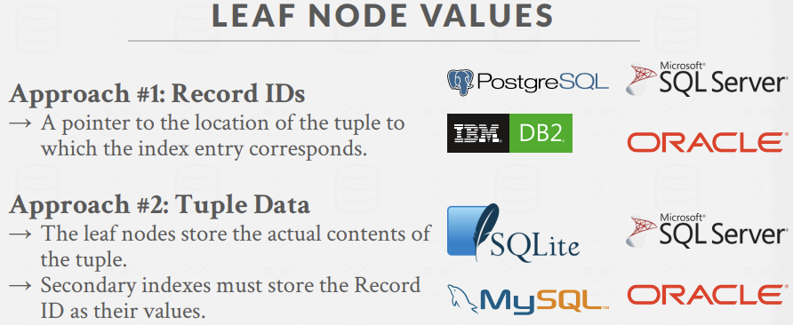   

B树不同于B+树的点在于，B树在任何节点包括内部节点，都能够存放kv。这带来的进一步区别是，B树中不会有任何重复的key，而B+树会有重复的key。  
B+树做删除时，可能需要把内部节点上的key也一并删除，这取决于我们是否要做重新平衡。  
尽管B树的空间成本更小，但通常任何系统中都不会使用B树，因为当我们使用多线程进行更新时，B树的代价更昂贵，因为修改后可能会对该kv上下移动，我们必须在这两个方向上都加上latch。在B+树中，我们只对叶子节点修改，我们可能需要将修改结果向上传播，但依然只需要一个方向。  

对B+树来说，insert操作可能是个递归的过程，因为当我们插入到对应叶子节点时，叶子节点可能会满，需要一分为二，其父节点需要新增一个key来指向新增的叶节点，若父节点也满，就需要不断向上递归新增内部节点，直至有父节点不满或到root分裂为止。  

delete操作也是如此，如果该叶节点至少是半满的，那么成功删除后不需要做任何调整；但若叶节点只有M/2-1个entry了，则可能需要向上调整，也就是split的逆向操作，merge。  
首先，我们可以看左右两边兄弟节点的(来自一个parent，否则parent节点的key可能也需要调整，情况会变得糟糕)entry数量，如果借来一个不会导致他们的分裂，则没问题；  
如果该方案行不通，就得merge，我们会和其中一个兄弟节点merge，于是父节点少了一个key，这个merge过程也是递归的。  
更具体的，我们在做这类递归的时候，从root开始向下扫描的时候用stack把遍历到的节点入栈，于是递归时取出栈头操作，并且遍历到父节点就需要给该节点上latch，因为后续子节点可能会告诉它要合并或拆分等修改操作。  

根据相关统计表明，整棵树的填充因子在67%左右。高度为3，M=1333 = 2,406,104 entries；高度为4，M=1334 = 312,900,721 entries。level 1 = 1 page 8 KB，level 2 = 134 pages = 1MB，level 3 = 17956 pages = 140MB。  

我们可以使用多buffer pool，一个bp管理data page，一个bp管理index page。  

Node size关系到查询速度，对于不同的存储设备，不同的size带来的性能有显著差异，一般来说存储设备越慢，node size就尽量大一些，如HDD，size更大会使他访问page更少，更多的时候在做单个page内的scan，对磁道寻址友好。  
具体的size取决于workload，即leaf node scans vs. root-to-leaf traversals。对在叶子节点上扫描来说，更适合大小更大的节点，因为我们可以进行更多的顺序扫描；如果我们进行的查找需要进行大量的随机I/O，那么size更小的节点更为合适。

关于delete带来的merge，一些DBMS不会经常做merge。  
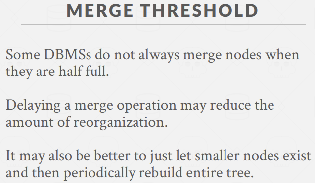   
因为可能在之后不久，我们又往该节点中插入了一些数据，导致又需要split。而merge操作、split操作的代价很昂贵，故更多的做法是定期重新平衡B+树，或直接从头开始重建树。

#### Clustered indexes
聚簇索引，建表的时候定义一个索引，索引对page中tuple的物理布局进行匹配和排序。像MySQL将tuple存储在叶子节点上，这就属于clustered index，这保证磁盘上page的tuple都以主键顺序排序的。在MySQL中如果我们没有指定pk，它会为我们定义一个，会使用row id或record id作为pk，以此来弄清楚tuple的实际位置。  

#### Selection conditions
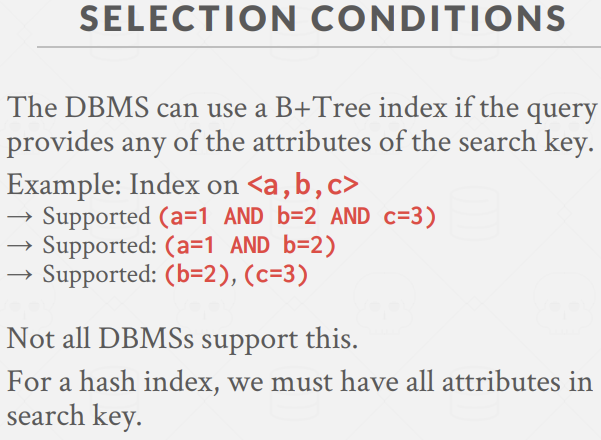  
这里也体现了B+树相比于hash表的一个优势，那就是我们无须通过一个具体的key来进行查找，而是用key的一部分，我们可以根据a和b进行查找，但是hash表是根据a、b、c做的hash，只用a和b就hash不到目标bucket中。  
如果我们使用的是Hash索引，那就必须使用完整的key来做查找，我们没有办法进行对key的部分做查找，也没办法做范围查找，只能做对完整key的定点查找。  

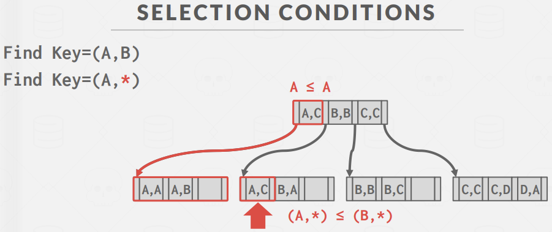  
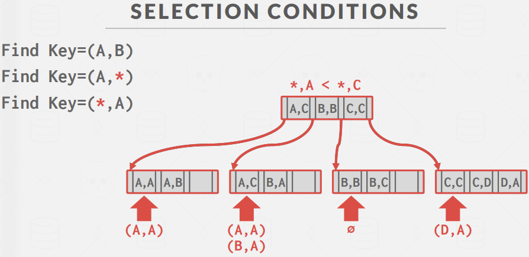   

例如，PostgreSQL支持hash index，当我们对table emails的email建hash index，我们select ... where email = 'xxx';这是很OK的，这是定点查找，在hash中挺快，我们通过EXPLAIN查看query plan可以看到是hash index scan。但如果是类似select ... where email like 'xx%';，那就会花很长时间了，可以看到是对emails表的seq scan，因为这种场景hash就是做不到匹配，那么只能使用默认的顺序扫描来做查找。  

我们对email同时建hash index和btree index，select ... where email = '000';，则query plan会告诉你用hash index。select ... where email > '000';，则采用seq scan，select ... where email > 'z00';，则采用btree index scan，这是因为对000来说，我们可能还是要遍历大部分email，那不如直接进行顺序扫描来的效率更高，但对z00来说，通过索引我们能扔掉大量数据，找到满足要求的第一个B+树叶节点，向右扫描即可。这就取决于cost model的设计。  

#### B+树中的变长key问题

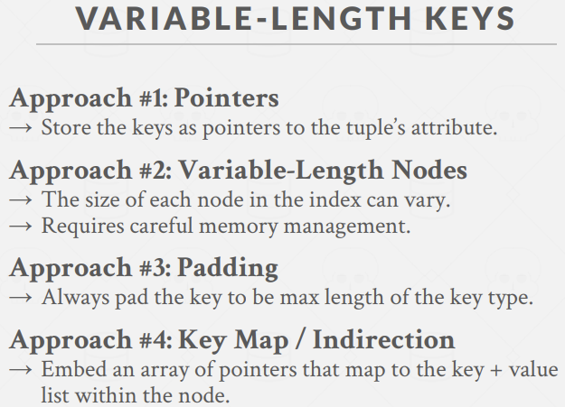  
方案1：不将key本身放在节点中，保存的是指向某个tuple的属性的指针，这种情况下查找的时候代价很高，如今基本没人这么做。  
方案2：可变长的node，这同样不够好，因为我们希望page大小在bp中、在磁盘中的size始终是一样的，这样就无须担心如何在bp中找到空间frame放入page了，这需要对memory管理的更细心。  
方案3：填充。保留对齐而浪费空间。  
方案4：间接映射，更常见的做法。将key指针放在key数组中。这和slotted page中tuple的布局很像，这里key+value从后往前存储，sorted key map则是从前往后顺序存储。key+value是不是有序存放不重要，key map中的key是有序的即可，每个元素指向对应的kv对，即对应的offset值。    
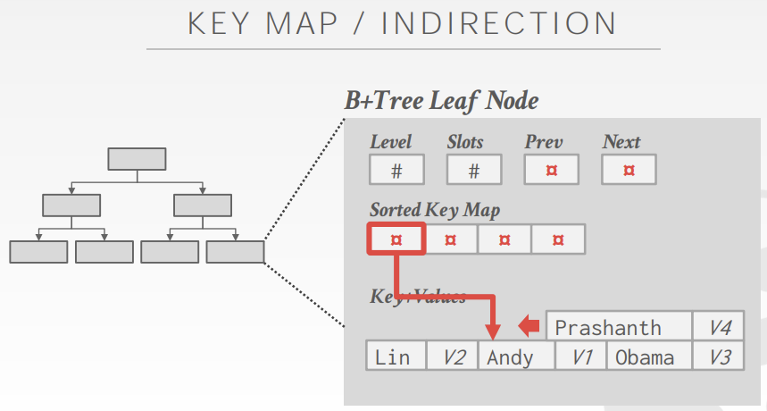   
事实上，节点的容量应该是固定的，但是在这种场景下可能还达不到固定kv数就满了，这时我们可以采用overflow page来存放剩余的kv并链接给该page。  

#### B+树中冗余key问题
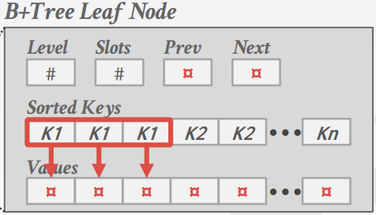
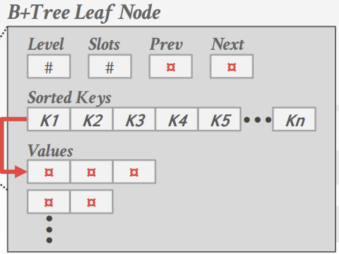   
一种是就存储重复的key多次，一种方案是给每个key维护一个包含多个value的list。第一种方案更常用。  
其中，对于方案1，我们不能保证所有的相同key的kv都保存在一个page中，当该key出现很多次的时候，这时我们可以使用overflow chain的形式，给这样的leaf node再单独加上overflow node来容纳同一个key的数据。  
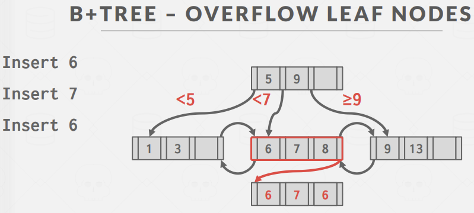   

另一种方案是，我们可以让每个key unique，即在插入的key后面append对应tuple的record id。当然这种方案有时候看上去会有点蠢，因为可能我们存的value就是record id，但它同时被用来当key使用。  
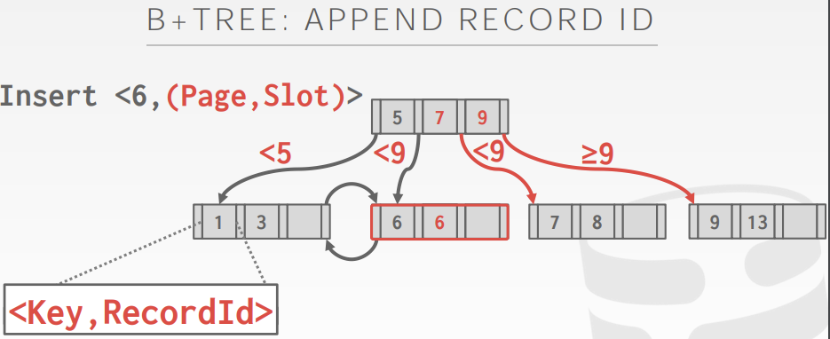   

#### 在单节点内部搜索

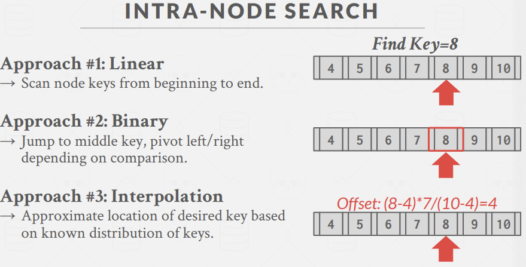   
顺序遍历；二分查找；大概估算位置，跳转后左右搜索。更多是采用二分查找，但二分查找的代价是需要提前有序，顺序查找就可以不管page内的key序。

####一些B+树上的优化

##### prefix compression
数据压缩，具体称之为前缀压缩。  
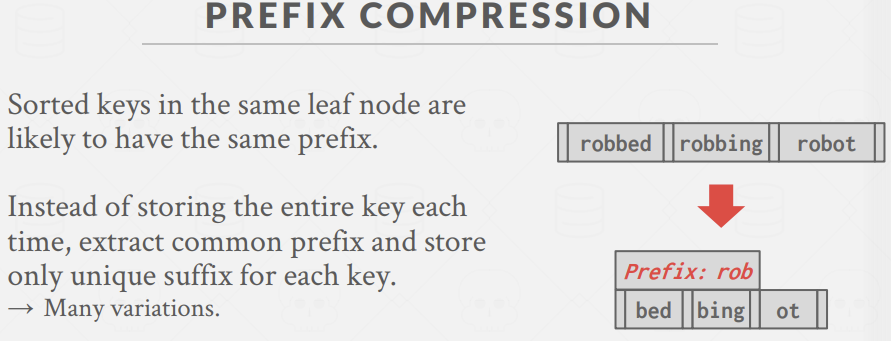   
也可以用Trie Tree。  

##### deduplication
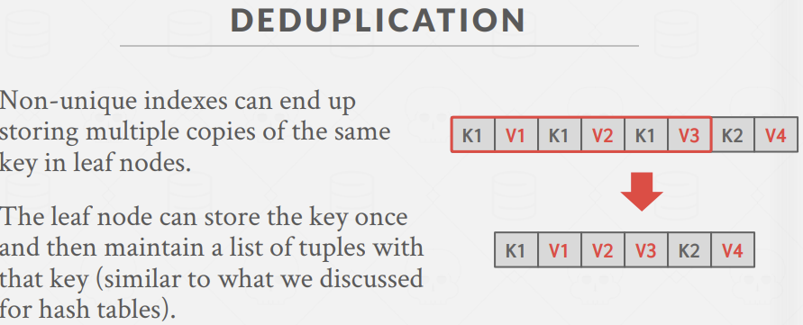   

##### Suffix truncation
基本思路是，我们无需在我们的内部节点中存储完整的key，以此来弄清楚我们是向哪个子节点走。在该例子下，也许仅保存abc和lmn就足够了，也就是在inner node中仅保存一个key的前缀，把剩余后缀剔除掉。  
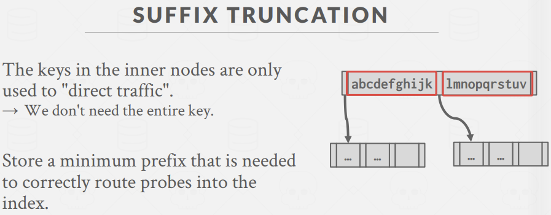   

##### Bulk insert
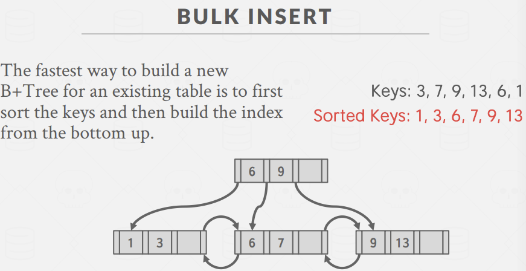   
批量插入。在某些场景下，我们可能会提前知道批量的keys，这时候挨个插入代价依然比较高，我们可以采取自底向上的方式，即直接对key排序，然后按序组成各个叶子节点，再向上组织父节点。  

##### pointer swizzling
在我们的数据库系统中，B+树节点中保存的指针实际指的是page id，这就涉及到向buffer pool索取相应page id的指针。折就会给bp manager中的page table等加latch来查找page，有一定的花费。    
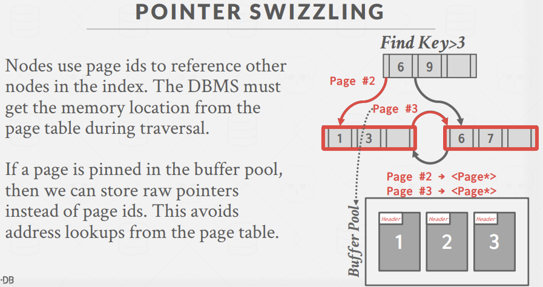   
所以pointer swizzling的思想就是，如果我们知道某page当前被pin住，那么我们完全可以把 page id替换为page\*，即真实的bp中该page的指针，而无需经过bp manager的处理。当然我们需要确保，如果该page被移出内存写入磁盘，就不能保存page指针。  
这看似如果page经常换入换出，保存这样的指针没什么提升。但是当我们考虑一棵树在db中，那些树更靠近根节点的几层由于使用频率非常高，很多时候被cache在内存中很长时间是非常正常的，而他们被access的次数也高，存储这样的page\*指针是非常划算的。

#### implicit index
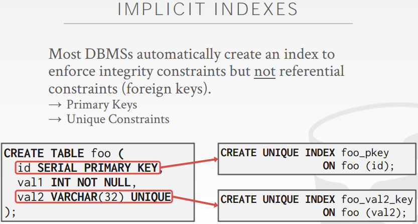   
大多数DBMS为隐式的为pk或有unique性质的属性做索引，这也是因为当我们插入更新一个tuple的时候，我们需要去查看这些属性有没有冲突，如果没有索引就可能需要顺序扫描整个table，这就很麻烦，建index就把查重事情做简单了。  
但对外键来说，一般不会做这样类似的索引，除非指向的属性也北有unique constraints。  
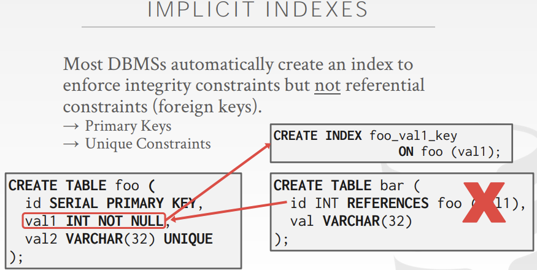   

#### partial index
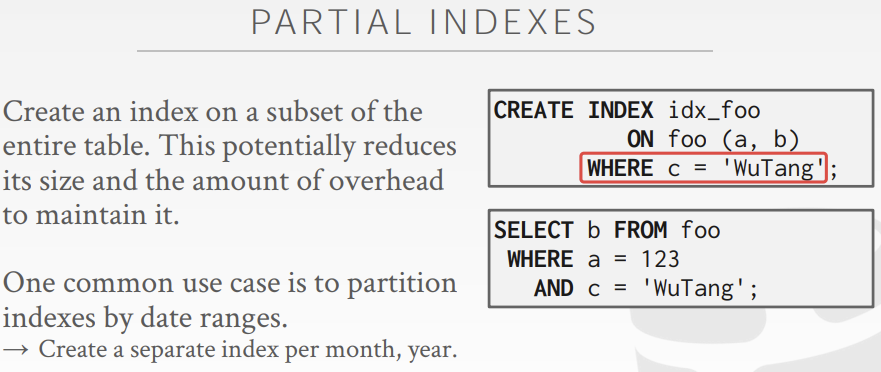   

#### covering index
覆盖索引。如下图例子中，我们覆盖了查询的对象，可以直接根据index结果返回数据，而不需要再去根据record id查找对应的page等，这还涉及多次I/O，进而减少DBMS bp资源的竞争。  
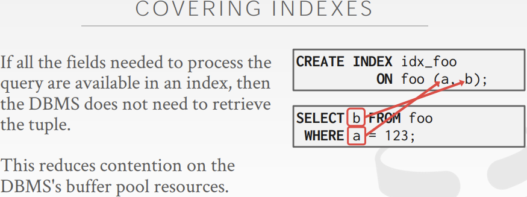   

#### index include columns
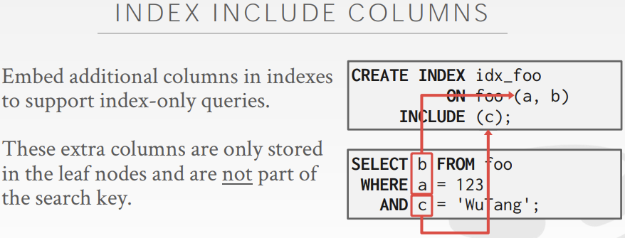   

#### B+树总结
在B+树中，内部节点的key不能够告诉我们某个key是否存在，我们必须要遍历到叶节点才可以。这意味着当我们想做一次点查时，每一层都可能会产生一次buffer pool page miss。  
所以，如果我们在没有遍历到底部叶节点的情况下，就能在上层搞清楚某个key是否不存在就更好了，比如前缀树。  

#### Trie index
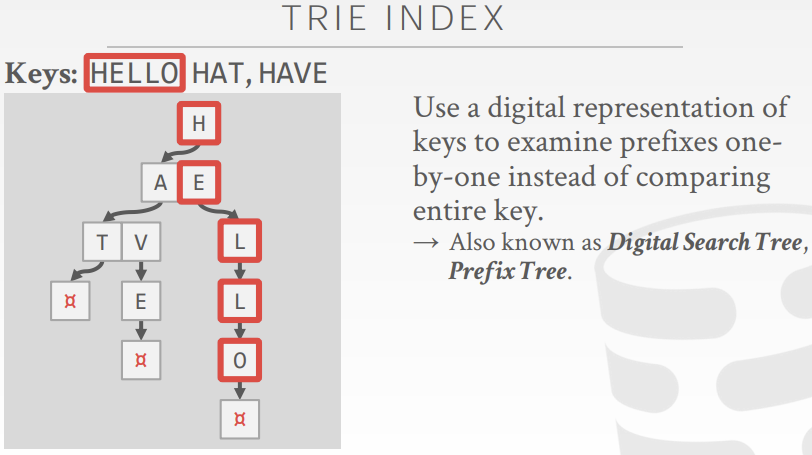   
Trie的形状取决于key的分布和长度，它是一个deterministic树，即我们不论以什么方式做各种插入更新删除，完成后树的形状总是一样的，有一样的物理数据结构，也不需要像B+树一样进行重新平衡等操作。  
在Trie中，所有操作的复杂度都是O(k) where k = lengthof(key)。但是对于顺序扫描来说，Trie做顺序扫描的话，需要在内部节点间上下移动，也需要保存从root到当前节点的前缀信息，不像B+树可以沿着叶节点扫描。但如果是点查，那Trie的速度就能比B+树快很多。  

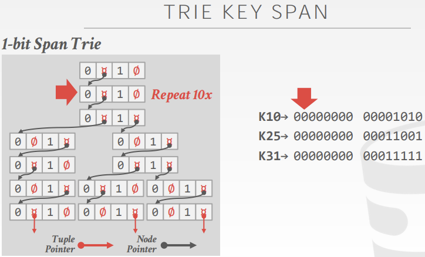   
一般来说不会拿1bit来作为单node存的信息，会让树深度很大，一般至少8bit。   

#### Radix tree

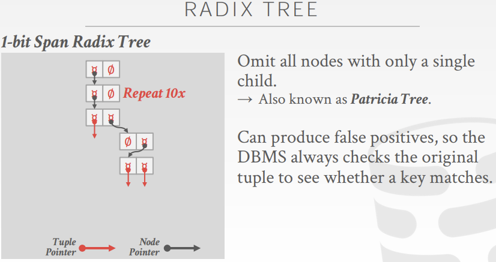   
垂直压缩后的Trie tree。当树是静态的时候，这种树能保证和原来的Trie一致，但经历一些插入删除后，可能就会带来false positive问题。   

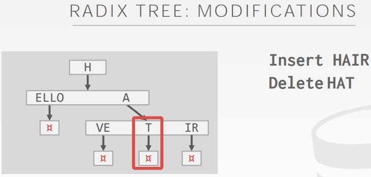   
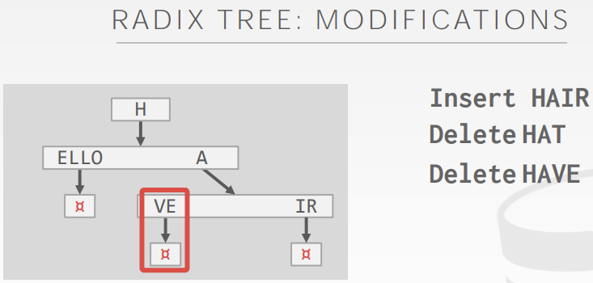   
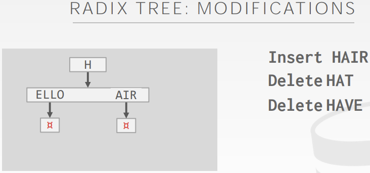   

### 总结
上述提到的B+树、Trie树的使用场景主要是point query、range query，它们对keyword查找来说是很差的，比如搜索所有包含'aaa'的网页，这只是某个属性中的一部分，那么查找起来就不适用了。

#### inverted index
倒排索引。会将word映射到包含这个word的trecord中。    
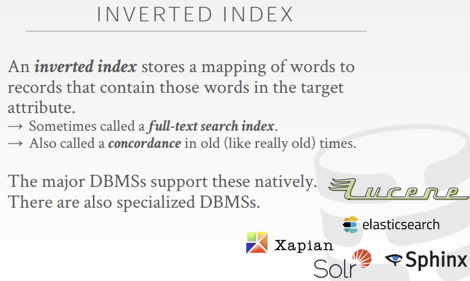   