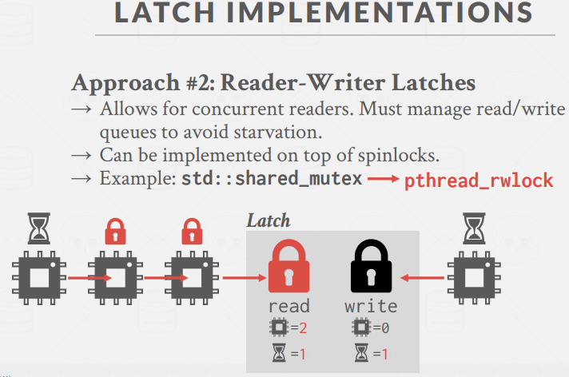
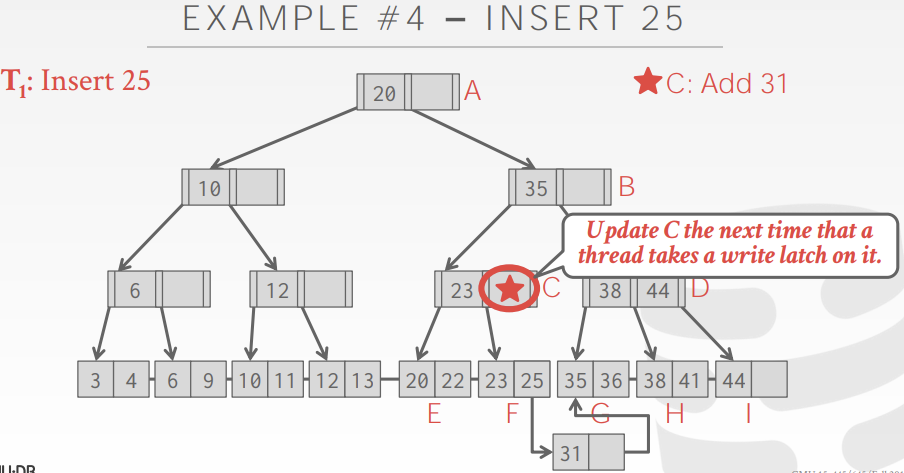

### 并发控制
  

#### Lock 与 Latch
  

##### Latch读写模式
  

##### Latch实现
方案1：Blocking OS Mutex。 例如C++中的std::mutex，我们可以很容易的调用它们。  
不同于futex，futex，即fast userspace mutex，我们会在内存空间中分配一个1bit或1byte的内存空间，通过对这块空间尝试进行CAS的原子动作来获取这个latch。  
如果我们在userspace中进行快速的CAS操作就获取到了latch，则一切结束，如果没能拿到，就会去使用速度相对慢很多的OS层的mutex。在此之后，OS会得知某个线程被mutex阻塞了，没办法获取到对应的latch，于是让调度器来进行调度，这样该线程就暂时运行不了了。所以我们会尽量避免使用OS层面的东西，在用户空间层面就处理掉。  
  
所以如果是高contention系统，尽量避免使用OS中的mutex。  

方案2：Test-and-Set Spin latch(TAS)   
它基于现代CPU一条指令，可以在一个内存地址上进行单次CAS操作，即检查这个内存地址上的值是否和我认为的相等。  
  

方案3：Reader-Writer Latch  
我们可以在基础的latch原语之上构建出spin lock和POSIX mutex，然后通过管理不同的队列来跟踪不同类型的latch有哪些线程等待过去获取。  
对这种读写锁，我们可以给读锁和写锁各自分配#当前临界区内线程、#等待线程。  
如下图，先有两个read请求，因为发现没有人占有写锁，故直接获取read latch，进入临界区，而后来了个write请求，它发现read latch被占用，于是进入写锁等待队列。再后面来一个read请求，因为发现有read请求等待获取，故也进入读锁等待队列。有很多实现方式，这里我们这样做是为了确保读写平衡，不让read或write出现饥饿现象。  
  
read和write的优先级取决于具体场景，比如write请求不多，但是更改的数据很关键，我们可以给write latch更高的优先级。  

#### Latch在hash table上的使用
首先latch在hash table上是比较好实现的，因为我们都是先查看hash，再看bucket，access顺序是一致的，不存在会死锁的问题。如果是静态hash表，表大小能够固定下来的话，情况会更为简单。  
以linear probe hashing为例，我们的每个查询都是从表内某处开始往下查找的，类似环形buffer，所以只要不让某个线程会反向扫描，不存在会死锁的情况。  
如果要调整表大小，就需要给整个table加一个global latch。  
   

加锁粒度上，可以分为下列方法。  
   
采用page latch，我们所保存的latch数量比较少，一个latch对应一个page，但这降低了我们的并行性。如果我们对每个slot用一个latch管理，这会有更高的并行性，但这样latch数量更多，而且当我们进行扫描时，获取和释放latch付出的代价更大。  
   
在page latch中，T2获取page1的latch被阻塞，等T1释放后获取到，随后再获取page2的write latch，插入E。  

   

#### Latch在B+树上的使用
在B+树中，我们保障线程安全有两个关键点。  
第一是，当有两条线程同一时间试着修改同一个节点的数据时；  
第二是，有一条线程在遍历B+树，而在它到达叶节点前，另一条线程对B+树进行了修改并引起了节点的merge或split，于是我们想查找的数据可能位置被改变了。  

   
假设第一条线程想要delete 44，它遍历到I，删掉44，发现不满足半满，于是想向隔壁H借41来。另一条线程想进行Find 41，当T2到达D时，它发现自己该进入节点H，但在这时，T1把41从H放到了I中，于是T2访问H，发现41不见了。  
   
在这种场景下，我们得到了一个false negative(假阴性)的结果，T2以为41不在树中了，于是发生Segmentation fault。  

##### Latch crabbing/coupling
latch crabbing是一个用来保证多线程同时access/modify B+树的协议。在该协议中，我们需要给parent和child都获取latch，若child为safe node，才可以把parent的latch释放掉。  
其中关于safe node的定义为：更新时既不会split也不会merge的node。也即on insertion，该节点not full；on deletion，该节点more than half-full。  
   
所以对于查找来说，我们依次拿parent和child的read latch，往下遍历时把parent的latch释放掉，也即手中最多只持有两个node的latch。  
而对修改操作来说，没遍历到叶节点前我们无法判定任何一个path上的node是否为safe，故需要一路获取每个node的write latch。  

   
对Find操作来说，我们需要保证先获取到child的latch后再释放parent的latch，防止中间插入其他相关操作修改了parent节点的状态。

   
对于一个delete操作，我们获取A的write latch后又获取B的write latch，这时我们发现B不满足more than half-full性质，所以是不安全的，不能释放A的锁。  
   
随后我们继续向下走，获取到C的write latch，这时我们发现C满足more than half-full性质，即是个safe node，我们就可以把A、B的latch释放掉。  
后来我们又到达H，因为发现H也满足deletion上的safety，故可以把D的latch也释放掉。  

所以基本上来说，在B+树中，当线程往下进行遍历时，我们需要通过一个stack来保存一路上所持有的latch。在某个时间点我们到达一个safe node时，就可以释放掉该节点之前所有节点上的latch。   

再看insert操作，其对应的safety为not full。  
   
因为B满足not full性质，所以B即使被修改，也不会再去修改它的parent A，可以把A的latch释放掉了。
   
随后我们发现D全满，故不可以释放B的latch，再到I，我们发现I未全满，故释放掉B和D的latch，执行插入45的操作。完成后把I的latch也释放掉。  

从正确性的角度来说，先释放B还是先释放D都无所谓，因为如果先释放的是D，B被lock住所以没有线程能进入D。但是从性能的角度来说，我们会先去释放parent节点的latch，尽早释放上层节点的latch是更关键的。  

   
假如我们现在要插入25，因为F是全满的，所以我们现在持有C和F的write latch。我们需要对F做split，给C下面新添加一个page，并将31放入其中，接着更新parent节点。  
   
这里存在一个问题是，对于新page J，我们是否需要加锁？保守的来说最好加上锁，因为尽管我们锁住了C，不可能会有其他线程从上往下进入J，但是如果有线程在对B+树做叶节点扫描，而此时我们又更新了左右兄弟指针，则可能会访问到J。  

###### 瓶颈点
我们可以发现，以上任何insert、delete操作，都首先会争抢root节点的write latch，这显然成为了提高并行能力的瓶颈。每次只能有一个更新操作的线程进入该树。  

###### better latching algorithm
类似于乐观锁，基于一种乐观的假设，即大部分线程不需要对叶节点进行拆分或合并操作。在向下遍历B+ tree的时候，我们每次采用的是read latch，而不是write latch，然后在处理叶结点时使用write latch。  
如果叶节点不是safe的，即我们猜错了，那么就使用悲观算法重新遍历再做一次。  
   
   
这也是在bustub中采用的技术，即先乐观搜索，若leaf不满足safe条件再悲观地更新一次。因为在真实数据库系统中，我们的node可能有8kb、16kb大，单一node就有大量的key，使用大部分更新操作并不会涉及split与merge，等遇到需要split/merge的，再回退到latch crabbing。对于争抢率不高的树，这种乐观算法带来的代价是更低的。    

   
如本次delete 38，我们一路上get and release read latch，最好获取叶节点H的write latch，执行delete 38。  

   
但这次insert 25，我们发现F节点需要被split，于是从头重新以latch crabbing形式做一遍。  

##### 叶节点遍历
之前我们讨论的所有情况都是从root开始的自顶向下遍历，在这种场景下如果某个desired latch获取不到，线程就会等在这，也永远不会出现死锁。但是如果有线程是对叶节点扫描该怎么处理呢？  

   
如线程T1，先获取A的read latch，后获取到C的latch后释放A的latch，并开始向左扫描，于是存在同时拥有B和C的latch的时刻，当获取B latch后释放C latch。  

   
对于如下情况也可以接受，T1、T2可以同时拥有B、C latch，因为read latch可以被分享，故不会出现死锁。  

但对如下情况，因为我们采用的是better crabbing，T1、T2一起获取root latch是允许的，因为都是read latch。但是T1获取C的write latch，而T2获取B的read latch。  
   
在本例子中，C是safe状态，所以删完就结束了，可能就没问题。但如果想跟B merge，那么就会出现T1争抢B latch、T2争抢C latch的场景，导致死锁。  
最简单的做法，就是我们不让T2继续执行了，我们会重新执行这个操作。一般等待的时间只有几微秒就够了。  

   

##### 父节点更新优化
每个一个叶节点overflow，我们至少会更新三个节点：被splt的叶节点，新叶节点，父节点。  
B-link tree的优化是，当一个叶节点满了，拖迟对它父节点的更新。  
这样我们就不需要从头开始拿着write latch一路向下遍历了，而是只需要更新这棵树全局信息表中的一些信息，当之后有线程遍历到这棵树时，我们再来做这个更新。  

   
在这里我们修改了F，也创建了新leaf node，但是没有更新C的内容，而是记录一下信息，给C打上这样的一个标记。   
   

当T2执行Find 31时，也会遍历到节点F，然后发现有overflow node，于是找到31。  
   

当T3执行Insert 33这样的更新操作，一路加read latch到达B，我们发现全局信息表中有对C的修改，于是给C加write latch而不是read latch，随后先更新C，在C中插入31，然后再给新overflow page加write latch，然后插入33。  
   